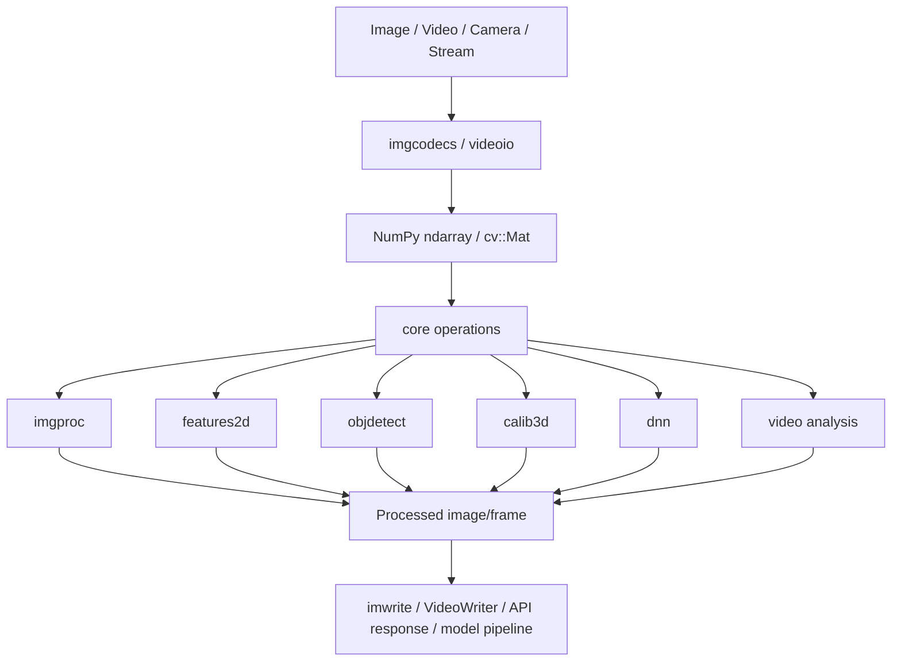
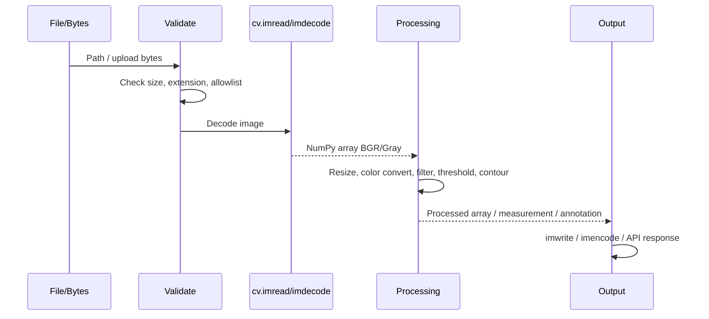

# OpenCV: Cơ sở lý thuyết, kiến trúc và thực hành

## 1. Mục tiêu tài liệu

Tài liệu này trình bày OpenCV theo hướng lý thuyết kết hợp thực hành, giúp người học nắm được:

- OpenCV là gì và vì sao nó được dùng rộng rãi trong computer vision, xử lý ảnh, xử lý video, robotics, camera pipeline, object detection, OCR, tracking và hệ thống AI thị giác.
- Mối quan hệ giữa OpenCV core, package Python `opencv-python`, `opencv-contrib-python`, các bản headless và namespace import `cv2`.
- Các khái niệm cốt lõi như pixel, image array, shape, dtype, channel, BGR/RGB, color space, coordinate system, ROI, mask, kernel, convolution, thresholding, contour, frame và video stream.
- Cách đọc, ghi, hiển thị, chuyển đổi màu, resize, crop, vẽ annotation và xử lý ảnh bằng `cv2`.
- Cách dùng các kỹ thuật xử lý ảnh cơ bản: blur, filter, threshold, morphology, edge detection, contour, histogram và geometric transform.
- Cách đọc camera/video bằng `cv.VideoCapture` và ghi video bằng `cv.VideoWriter`.
- Cách dùng OpenCV trong preprocessing dữ liệu computer vision và postprocessing kết quả model AI.
- Cách tổ chức project OpenCV trong hệ thống thực tế.
- Các lưu ý về hiệu năng, bảo mật, xử lý ảnh/video không tin cậy và triển khai trong Docker/server.
- Các lỗi thường gặp khi học và triển khai OpenCV.

Tài liệu này tập trung vào OpenCV-Python với API `cv2`, chủ yếu theo nhánh OpenCV 4.x vì đây vẫn là nền tảng tài liệu chính thức ổn định cho phần lớn dự án. Tại thời điểm viết, tài liệu chính thức `docs.opencv.org/4.x` hiển thị OpenCV 4.14.0-pre, trang releases chính thức liệt kê OpenCV 4.12.0 phát hành ngày 2025-07-09, còn PyPI hiển thị wheel `opencv-python` 5.0.0.93 phát hành ngày 2026-07-02. Khi làm dự án thực tế, nên kiểm tra đúng version `cv.__version__`, tài liệu API tương ứng và build options của môi trường đang dùng.

## 2. Tổng quan về OpenCV

OpenCV, viết tắt của Open Source Computer Vision Library, là thư viện mã nguồn mở cho computer vision và image processing. OpenCV được viết chủ yếu bằng C++ và cung cấp binding cho nhiều ngôn ngữ, trong đó Python binding được import qua:

```python
import cv2 as cv
```

Điểm dễ gây nhầm lẫn:

```bash
python -m pip install opencv-python
```

Nhưng khi import trong Python:

```python
import cv2 as cv
```

Tên package pip là `opencv-python`, nhưng namespace import là `cv2` để tương thích với lịch sử binding của OpenCV.

OpenCV thường được dùng trong:

- Đọc, ghi, resize, crop và chuyển đổi ảnh.
- Xử lý video/camera frame-by-frame.
- Chuyển đổi color space như BGR, RGB, grayscale, HSV, Lab, YCrCb.
- Làm mờ, khử nhiễu, sharpening, gradient, edge detection.
- Thresholding, morphology, segmentation đơn giản.
- Tìm contour, shape analysis, đo area, bounding box.
- Feature detection và matching như ORB, SIFT, AKAZE.
- Camera calibration, stereo vision và 3D reconstruction.
- Object detection truyền thống như Haar cascade, HOG.
- DNN inference qua `cv.dnn`.
- Preprocessing và postprocessing cho model PyTorch/TensorFlow/ONNX.
- Robotics, surveillance, document scanning, OCR, AR và embedded vision.

Workflow xử lý ảnh phổ biến với OpenCV:

```text
Image/video input -> cv.imread/VideoCapture -> NumPy array -> Processing -> Detection/measurement -> Visualization/export
```

OpenCV mạnh ở các bài toán cần thuật toán computer vision, xử lý frame liên tục, camera/video, geometry, feature extraction và performance. Với tác vụ web thumbnail/format conversion đơn giản, Pillow thường nhẹ và thuận tiện hơn. Với xử lý ảnh khoa học trên NumPy, scikit-image có API học thuật rõ hơn. Trong hệ thống AI hiện đại, OpenCV thường đứng ở lớp input/output, preprocessing, augmentation đơn giản và postprocessing kết quả model.

### 2.1. Đặc điểm nổi bật

| Đặc điểm | Ý nghĩa |
| --- | --- |
| Computer vision library | Cung cấp nhiều thuật toán xử lý ảnh, video và thị giác máy tính. |
| C++ core, Python binding | Code nặng chạy ở C++ bên dưới, Python dùng API tiện lợi. |
| NumPy integration | Ảnh trong Python thường là `numpy.ndarray`. |
| BGR mặc định | `cv.imread()` đọc ảnh màu theo thứ tự channel BGR, không phải RGB. |
| Image processing phong phú | Có blur, filter, threshold, morphology, gradient, contour, histogram. |
| Video/camera support | `VideoCapture` và `VideoWriter` xử lý camera, file video, stream tùy backend. |
| Geometry mạnh | Resize, affine transform, perspective transform, calibration. |
| Feature framework | ORB, SIFT, AKAZE, BRISK và matching descriptor. |
| `cv.dnn` | Chạy forward inference cho model deep learning đã serialize từ nhiều framework. |
| Contrib modules | Thêm module mở rộng như `xfeatures2d`, `aruco`, `ximgproc`, `tracking`, `quality`. |
| Build options linh hoạt | Codec, GUI, CUDA, OpenCL, IPP, GStreamer/FFmpeg tùy bản build. |
| Dùng rộng trong production | Phù hợp cho backend, edge device, robotics và batch pipeline. |

## 3. Cơ sở lý thuyết

### 3.1. Ảnh số và pixel

Ảnh số raster là lưới pixel. Mỗi pixel biểu diễn cường độ sáng hoặc màu tại một vị trí.

```text
Image = height x width x channels
Pixel = giá trị tại tọa độ (x, y)
```

Với ảnh grayscale:

```text
pixel = intensity
```

Với ảnh màu BGR trong OpenCV:

```text
pixel = (B, G, R)
```

Trong Python, ảnh OpenCV thường là NumPy array:

```python
import cv2 as cv

img = cv.imread("input.jpg")
print(type(img))
print(img.shape)
```

Kết quả ví dụ:

```text
<class 'numpy.ndarray'>
(1080, 1920, 3)
```

### 3.2. Shape, height, width và channel

Trong OpenCV/NumPy, shape của ảnh màu thường là:

```text
(height, width, channels)
```

Ví dụ:

```python
img = cv.imread("input.jpg", cv.IMREAD_COLOR)
h, w, c = img.shape
```

Với ảnh grayscale:

```python
gray = cv.imread("input.jpg", cv.IMREAD_GRAYSCALE)
print(gray.shape)
```

Kết quả chỉ có hai chiều:

```text
(height, width)
```

So sánh với Pillow:

| Thư viện | Kích thước |
| --- | --- |
| OpenCV/NumPy | `img.shape == (height, width, channels)` |
| Pillow | `im.size == (width, height)` |

Nhầm thứ tự width/height là lỗi rất phổ biến khi chuyển code giữa OpenCV, Pillow, NumPy và model deep learning.

### 3.3. Dtype và range

Ảnh đọc bằng `cv.imread()` thường có dtype `uint8`.

```python
img = cv.imread("input.jpg")
print(img.dtype)
print(img.min(), img.max())
```

Với `uint8`, giá trị pixel nằm trong:

```text
0..255
```

Một số dtype thường gặp:

| Dtype | Range thường gặp | Khi dùng |
| --- | --- | --- |
| `uint8` | 0..255 | Ảnh thông thường, đọc/ghi file. |
| `uint16` | 0..65535 | Ảnh 16-bit, dữ liệu khoa học/medical/RAW-like. |
| `float32` | 0..1 hoặc giá trị thực | Processing số học, ML preprocessing. |
| `bool` | `False`/`True` | Mask logic trong NumPy. |

Khi chuyển ảnh sang float cho model:

```python
img_float = img.astype("float32") / 255.0
```

Không nên quên normalize nếu model kỳ vọng input 0..1 hoặc mean/std cụ thể.

### 3.4. BGR và RGB

OpenCV mặc định dùng BGR cho ảnh màu đọc bằng `cv.imread()`.

```python
img_bgr = cv.imread("input.jpg")
img_rgb = cv.cvtColor(img_bgr, cv.COLOR_BGR2RGB)
```

Điều này khác với:

- Pillow: thường dùng RGB.
- Matplotlib: hiển thị RGB.
- Nhiều model deep learning: thường kỳ vọng RGB.

Nếu hiển thị ảnh OpenCV bằng Matplotlib mà không convert, màu sẽ bị lệch:

```python
import matplotlib.pyplot as plt

plt.imshow(cv.cvtColor(img_bgr, cv.COLOR_BGR2RGB))
plt.show()
```

### 3.5. Coordinate system

OpenCV dùng hệ tọa độ ảnh với gốc ở góc trên bên trái:

```text
(0, 0) -----> x
  |
  |
  v
  y
```

Khi truy cập NumPy array:

```python
pixel = img[y, x]
```

Nhưng khi vẽ bằng OpenCV:

```python
cv.circle(img, (x, y), radius=5, color=(0, 255, 0), thickness=-1)
```

Lưu ý:

| Ngữ cảnh | Thứ tự |
| --- | --- |
| NumPy indexing | `[y, x]` hoặc `[row, col]` |
| OpenCV drawing point | `(x, y)` |
| Shape | `(height, width, channels)` |
| Size trong `cv.resize` | `(width, height)` |

### 3.6. ROI và crop

ROI là Region of Interest, tức vùng ảnh cần xử lý.

Trong NumPy/OpenCV, crop dùng slicing:

```python
roi = img[y1:y2, x1:x2]
```

Ví dụ:

```python
crop = img[100:300, 200:500]
```

Kích thước output:

```text
height = y2 - y1
width  = x2 - x1
```

Lưu ý: slicing thường tạo view, không copy dữ liệu ngay. Nếu cần ảnh độc lập:

```python
crop = img[y1:y2, x1:x2].copy()
```

### 3.7. Mask và binary image

Mask là ảnh một kênh dùng để chọn vùng xử lý.

Thông thường:

```text
0   -> không chọn
255 -> chọn
```

Ví dụ tạo mask theo màu HSV:

```python
hsv = cv.cvtColor(img, cv.COLOR_BGR2HSV)
mask = cv.inRange(hsv, (35, 50, 50), (85, 255, 255))
```

Dùng mask để lấy vùng:

```python
result = cv.bitwise_and(img, img, mask=mask)
```

Binary image rất quan trọng cho thresholding, morphology và contour.

### 3.8. Kernel và convolution

Kernel là ma trận nhỏ trượt qua ảnh để tính giá trị pixel output.

Ví dụ kernel blur 3x3:

```text
1/9 * [[1, 1, 1],
       [1, 1, 1],
       [1, 1, 1]]
```

Trong OpenCV:

```python
import numpy as np

kernel = np.ones((3, 3), dtype=np.float32) / 9
filtered = cv.filter2D(img, -1, kernel)
```

Các filter như blur, sharpen, Sobel, Laplacian đều dựa trên ý tưởng tính toán cục bộ quanh mỗi pixel.

### 3.9. Color space

Color space là cách biểu diễn màu.

| Color space | Ý nghĩa | Khi dùng |
| --- | --- | --- |
| BGR | Mặc định trong OpenCV | Đọc/ghi/xử lý OpenCV thông thường. |
| RGB | Phổ biến trong Pillow, Matplotlib, deep learning | Hiển thị hoặc đưa vào model. |
| Grayscale | Một kênh cường độ sáng | Threshold, edge detection, contour. |
| HSV | Hue, Saturation, Value | Segment theo màu, tracking object màu. |
| Lab | Lightness và kênh màu perceptual | Color correction, enhancement. |
| YCrCb | Luma/chroma | Một số bài toán video/skin detection. |

Chuyển đổi:

```python
gray = cv.cvtColor(img, cv.COLOR_BGR2GRAY)
hsv = cv.cvtColor(img, cv.COLOR_BGR2HSV)
rgb = cv.cvtColor(img, cv.COLOR_BGR2RGB)
```

### 3.10. Frame và video stream

Video có thể xem là chuỗi frame ảnh.

```text
Video = frame_0, frame_1, frame_2, ...
```

Mỗi frame thường là NumPy array tương tự ảnh:

```python
cap = cv.VideoCapture("input.mp4")
ret, frame = cap.read()
```

`ret` cho biết đọc frame có thành công không. `frame` là ảnh BGR nếu đọc thành công.

Trong video pipeline, cần quan tâm:

- FPS.
- Frame size.
- Codec.
- Backend như FFmpeg, GStreamer, Media Foundation, DirectShow.
- Latency.
- Dropped frames.
- Resource release.

## 4. Kiến trúc OpenCV

### 4.1. Sơ đồ kiến trúc Mermaid



OpenCV tách các phần khá rõ:

- `core` cho cấu trúc dữ liệu, toán học cơ bản, array operation.
- `imgcodecs` cho đọc/ghi ảnh.
- `imgproc` cho xử lý ảnh.
- `highgui` cho hiển thị window và UI đơn giản.
- `videoio` cho đọc/ghi video, camera, stream.
- `video` cho tracking, background subtraction, optical flow.
- `features2d` cho keypoint, descriptor và matching.
- `calib3d` cho camera calibration, stereo, pose.
- `objdetect` cho object detection truyền thống.
- `dnn` cho deep neural network inference.
- `ml` cho machine learning cổ điển.
- `photo`, `stitching`, `gapi` và các module khác cho workflow chuyên biệt.
- `opencv_contrib` cung cấp module mở rộng ngoài main modules.

### 4.2. Các thành phần quan trọng

| Thành phần | Vai trò |
| --- | --- |
| `cv.imread()` | Đọc ảnh từ file. |
| `cv.imwrite()` | Ghi ảnh ra file. |
| `cv.imshow()` | Hiển thị ảnh trong window desktop. |
| `cv.waitKey()` | Chờ phím và xử lý event window. |
| `cv.cvtColor()` | Chuyển đổi color space. |
| `cv.resize()` | Resize ảnh. |
| `cv.warpAffine()` | Affine transform. |
| `cv.warpPerspective()` | Perspective transform. |
| `cv.GaussianBlur()` | Làm mờ Gaussian. |
| `cv.filter2D()` | Custom convolution filter. |
| `cv.threshold()` | Global thresholding. |
| `cv.adaptiveThreshold()` | Adaptive thresholding. |
| `cv.Canny()` | Edge detection bằng Canny. |
| `cv.findContours()` | Tìm contour trong ảnh binary. |
| `cv.drawContours()` | Vẽ contour. |
| `cv.calcHist()` | Tính histogram. |
| `cv.VideoCapture` | Đọc camera/video/stream. |
| `cv.VideoWriter` | Ghi video. |
| `cv.dnn` | DNN inference. |
| `cv.getBuildInformation()` | Kiểm tra cấu hình build. |

## 5. Vòng đời xử lý ảnh và video

### 5.1. Luồng xử lý ảnh tổng quan



Trong pipeline thực tế:

1. Nhận ảnh từ file, camera, upload hoặc object storage.
2. Giới hạn file size và format ở tầng ứng dụng.
3. Decode bằng `cv.imread()` hoặc `cv.imdecode()`.
4. Kiểm tra `img is None`, shape, dtype, số pixel.
5. Convert color space nếu cần.
6. Resize/crop/normalize.
7. Áp dụng xử lý ảnh hoặc đưa vào model.
8. Postprocess kết quả: bounding box, contour, mask, label.
9. Vẽ annotation nếu cần.
10. Ghi output hoặc trả response.

### 5.2. Luồng xử lý video

```mermaid
sequenceDiagram
    participant S as Camera/Video file
    participant Cap as VideoCapture
    participant Loop as Frame loop
    participant Proc as Processing/Model
    participant W as VideoWriter/API

    S->>Cap: open source
    Cap-->>Loop: ret, frame
    Loop->>Proc: frame BGR
    Proc-->>Loop: result/annotated frame
    Loop->>W: write/display/stream
    Loop->>Cap: read next frame
    Cap->>Cap: release
    W->>W: release
```

Video khác ảnh tĩnh ở chỗ:

- Cần loop ổn định.
- Cần kiểm tra `ret`.
- Cần release camera/file.
- Cần kiểm soát FPS, latency và memory.
- Mỗi frame có thể xử lý nhẹ hơn để giữ realtime.
- Display bằng `cv.imshow()` không phù hợp cho server headless.

## 6. Các khái niệm cốt lõi

### 6.1. Đọc ảnh

```python
import cv2 as cv

img = cv.imread("input.jpg", cv.IMREAD_COLOR)

if img is None:
    raise FileNotFoundError("Cannot read image")

print(img.shape)
print(img.dtype)
```

Các flag thường dùng:

| Flag | Ý nghĩa |
| --- | --- |
| `cv.IMREAD_COLOR` | Đọc ảnh màu BGR, bỏ alpha. |
| `cv.IMREAD_COLOR_BGR` | Flag màu BGR trong API mới hơn; nếu môi trường không có, dùng `cv.IMREAD_COLOR`. |
| `cv.IMREAD_GRAYSCALE` | Đọc grayscale một kênh. |
| `cv.IMREAD_UNCHANGED` | Giữ nguyên dữ liệu, gồm alpha nếu có. |
| `cv.IMREAD_ANYDEPTH` | Giữ bit depth nếu decoder hỗ trợ. |
| `cv.IMREAD_ANYCOLOR` | Đọc ảnh với color format phù hợp nếu có thể. |

Luôn kiểm tra `img is None` vì `cv.imread()` không raise exception trong nhiều trường hợp đọc lỗi.

### 6.2. Ghi ảnh

```python
ok = cv.imwrite("output.jpg", img, [cv.IMWRITE_JPEG_QUALITY, 90])

if not ok:
    raise OSError("Cannot write image")
```

Một số option:

| Format | Option |
| --- | --- |
| JPEG | `cv.IMWRITE_JPEG_QUALITY` |
| PNG | `cv.IMWRITE_PNG_COMPRESSION` |
| WebP | `cv.IMWRITE_WEBP_QUALITY` |

Ví dụ PNG:

```python
cv.imwrite("output.png", img, [cv.IMWRITE_PNG_COMPRESSION, 3])
```

### 6.3. Hiển thị ảnh

```python
import cv2 as cv

img = cv.imread("input.jpg")
cv.imshow("image", img)
cv.waitKey(0)
cv.destroyAllWindows()
```

Lưu ý:

- `cv.imshow()` cần môi trường desktop/GUI.
- Trên server, Docker headless hoặc notebook, nên dùng Matplotlib hoặc lưu file.
- Nếu dùng Matplotlib, convert BGR sang RGB.

```python
import matplotlib.pyplot as plt

plt.imshow(cv.cvtColor(img, cv.COLOR_BGR2RGB))
plt.axis("off")
plt.show()
```

### 6.4. Thông tin array

```python
img = cv.imread("input.jpg")

print("shape:", img.shape)
print("dtype:", img.dtype)
print("height:", img.shape[0])
print("width:", img.shape[1])
print("channels:", img.shape[2] if img.ndim == 3 else 1)
print("min/max:", img.min(), img.max())
```

Các thuộc tính này là bước debug đầu tiên khi ảnh hiển thị sai, resize lỗi hoặc model nhận input sai shape.

### 6.5. Chuyển đổi màu

```python
gray = cv.cvtColor(img, cv.COLOR_BGR2GRAY)
rgb = cv.cvtColor(img, cv.COLOR_BGR2RGB)
hsv = cv.cvtColor(img, cv.COLOR_BGR2HSV)
```

Segment màu xanh lá trong HSV:

```python
hsv = cv.cvtColor(img, cv.COLOR_BGR2HSV)
mask = cv.inRange(hsv, (35, 50, 50), (85, 255, 255))
result = cv.bitwise_and(img, img, mask=mask)
```

HSV thường ổn hơn BGR/RGB cho bài toán chọn vùng theo màu vì hue tách khỏi brightness tương đối tốt hơn.

### 6.6. Resize

```python
resized = cv.resize(img, (640, 360), interpolation=cv.INTER_AREA)
```

Tham số size của `cv.resize()` là:

```text
(width, height)
```

Interpolation thường dùng:

| Interpolation | Khi dùng |
| --- | --- |
| `cv.INTER_NEAREST` | Mask, label map, pixel art. |
| `cv.INTER_LINEAR` | Resize thông thường, mặc định phổ biến. |
| `cv.INTER_AREA` | Downscale ảnh tự nhiên. |
| `cv.INTER_CUBIC` | Upscale chất lượng cao hơn, chậm hơn. |
| `cv.INTER_LANCZOS4` | Chất lượng cao, chậm hơn. |

Resize giữ aspect ratio:

```python
def resize_max(img, max_side: int):
    h, w = img.shape[:2]
    scale = max_side / max(h, w)
    if scale >= 1:
        return img.copy()

    new_w = int(round(w * scale))
    new_h = int(round(h * scale))
    return cv.resize(img, (new_w, new_h), interpolation=cv.INTER_AREA)
```

### 6.7. Crop và ROI

```python
x1, y1, x2, y2 = 100, 50, 500, 350
roi = img[y1:y2, x1:x2]
```

Nếu cần sửa ROI nhưng không ảnh hưởng ảnh gốc:

```python
roi = img[y1:y2, x1:x2].copy()
```

Nếu muốn vẽ vào ảnh gốc trên vùng ROI:

```python
img[y1:y2, x1:x2] = cv.GaussianBlur(img[y1:y2, x1:x2], (15, 15), 0)
```

### 6.8. Vẽ annotation

```python
annotated = img.copy()

cv.rectangle(annotated, (50, 50), (300, 220), (0, 255, 0), 2)
cv.circle(annotated, (175, 135), 40, (0, 0, 255), -1)
cv.line(annotated, (50, 50), (300, 220), (255, 0, 0), 2)
cv.putText(
    annotated,
    "object",
    (50, 40),
    cv.FONT_HERSHEY_SIMPLEX,
    0.8,
    (0, 255, 0),
    2,
    cv.LINE_AA,
)
```

Màu trong OpenCV là BGR:

```text
(0, 0, 255) -> đỏ
(0, 255, 0) -> xanh lá
(255, 0, 0) -> xanh dương
```

### 6.9. Blur và smoothing

```python
blur = cv.blur(img, (5, 5))
gaussian = cv.GaussianBlur(img, (5, 5), 0)
median = cv.medianBlur(img, 5)
bilateral = cv.bilateralFilter(img, 9, 75, 75)
```

| Hàm | Khi dùng |
| --- | --- |
| `cv.blur()` | Mean blur đơn giản. |
| `cv.GaussianBlur()` | Làm mờ tự nhiên, giảm noise trước edge detection. |
| `cv.medianBlur()` | Tốt với salt-and-pepper noise. |
| `cv.bilateralFilter()` | Giảm noise nhưng giữ edge tốt hơn, chậm hơn. |

### 6.10. Thresholding

Global threshold:

```python
gray = cv.cvtColor(img, cv.COLOR_BGR2GRAY)
ret, thresh = cv.threshold(gray, 127, 255, cv.THRESH_BINARY)
```

Otsu threshold:

```python
ret, otsu = cv.threshold(
    gray,
    0,
    255,
    cv.THRESH_BINARY + cv.THRESH_OTSU,
)
```

Adaptive threshold:

```python
adaptive = cv.adaptiveThreshold(
    gray,
    255,
    cv.ADAPTIVE_THRESH_GAUSSIAN_C,
    cv.THRESH_BINARY,
    11,
    2,
)
```

Thresholding thường dùng trước contour, OCR preprocessing, document scanning và segmentation đơn giản.

### 6.11. Morphology

Morphology xử lý ảnh binary bằng structuring element.

```python
kernel = cv.getStructuringElement(cv.MORPH_RECT, (5, 5))

eroded = cv.erode(mask, kernel, iterations=1)
dilated = cv.dilate(mask, kernel, iterations=1)
opened = cv.morphologyEx(mask, cv.MORPH_OPEN, kernel)
closed = cv.morphologyEx(mask, cv.MORPH_CLOSE, kernel)
```

| Operation | Ý nghĩa |
| --- | --- |
| Erosion | Làm nhỏ vùng trắng, loại noise nhỏ. |
| Dilation | Làm lớn vùng trắng, nối vùng gần nhau. |
| Opening | Erosion rồi dilation, loại noise nhỏ. |
| Closing | Dilation rồi erosion, lấp lỗ nhỏ. |
| Morphological gradient | Làm nổi biên vùng. |

### 6.12. Edge detection

Canny edge detection:

```python
gray = cv.cvtColor(img, cv.COLOR_BGR2GRAY)
blur = cv.GaussianBlur(gray, (5, 5), 0)
edges = cv.Canny(blur, 50, 150)
```

Sobel gradient:

```python
sobel_x = cv.Sobel(gray, cv.CV_64F, 1, 0, ksize=3)
sobel_y = cv.Sobel(gray, cv.CV_64F, 0, 1, ksize=3)
```

Edge detection thường dùng trong:

- Document scanner.
- Shape detection.
- Lane detection.
- Preprocessing trước Hough transform.
- Debug biên object.

### 6.13. Contours

Contour là đường nối các điểm liên tục trên biên có cùng màu/cường độ. Contour thường được tìm trên ảnh binary.

```python
gray = cv.cvtColor(img, cv.COLOR_BGR2GRAY)
ret, thresh = cv.threshold(gray, 127, 255, cv.THRESH_BINARY)

contours, hierarchy = cv.findContours(
    thresh,
    cv.RETR_EXTERNAL,
    cv.CHAIN_APPROX_SIMPLE,
)

annotated = img.copy()
cv.drawContours(annotated, contours, -1, (0, 255, 0), 2)
```

Thông tin contour:

```python
for cnt in contours:
    area = cv.contourArea(cnt)
    x, y, w, h = cv.boundingRect(cnt)
    perimeter = cv.arcLength(cnt, True)
```

Lưu ý quan trọng: OpenCV tìm object trắng trên nền đen tốt nhất. Nếu ảnh binary bị đảo nền/object, contour có thể không như mong muốn.

### 6.14. Histogram

Histogram mô tả phân bố giá trị pixel.

```python
gray = cv.cvtColor(img, cv.COLOR_BGR2GRAY)
hist = cv.calcHist([gray], [0], None, [256], [0, 256])
```

Histogram equalization:

```python
eq = cv.equalizeHist(gray)
```

CLAHE:

```python
clahe = cv.createCLAHE(clipLimit=2.0, tileGridSize=(8, 8))
enhanced = clahe.apply(gray)
```

Histogram hữu ích để kiểm tra ảnh quá tối/sáng, tăng contrast hoặc debug threshold.

### 6.15. Geometric transform

Affine transform:

```python
h, w = img.shape[:2]
center = (w // 2, h // 2)
matrix = cv.getRotationMatrix2D(center, 30, 1.0)
rotated = cv.warpAffine(img, matrix, (w, h))
```

Perspective transform:

```python
import numpy as np

src = np.float32([[10, 10], [300, 30], [280, 400], [20, 380]])
dst = np.float32([[0, 0], [300, 0], [300, 400], [0, 400]])

matrix = cv.getPerspectiveTransform(src, dst)
warped = cv.warpPerspective(img, matrix, (300, 400))
```

Perspective transform thường dùng cho document scanner, bird-eye view, board detection và camera geometry.

### 6.16. VideoCapture

Đọc camera:

```python
import cv2 as cv

cap = cv.VideoCapture(0)

if not cap.isOpened():
    raise RuntimeError("Cannot open camera")

while True:
    ret, frame = cap.read()
    if not ret:
        break

    gray = cv.cvtColor(frame, cv.COLOR_BGR2GRAY)
    cv.imshow("frame", gray)

    if cv.waitKey(1) == ord("q"):
        break

cap.release()
cv.destroyAllWindows()
```

Đọc file video:

```python
cap = cv.VideoCapture("input.mp4")

while cap.isOpened():
    ret, frame = cap.read()
    if not ret:
        break

    # process frame

cap.release()
```

### 6.17. VideoWriter

```python
cap = cv.VideoCapture("input.mp4")

fps = cap.get(cv.CAP_PROP_FPS)
width = int(cap.get(cv.CAP_PROP_FRAME_WIDTH))
height = int(cap.get(cv.CAP_PROP_FRAME_HEIGHT))

fourcc = cv.VideoWriter_fourcc(*"mp4v")
writer = cv.VideoWriter("output.mp4", fourcc, fps, (width, height))

while cap.isOpened():
    ret, frame = cap.read()
    if not ret:
        break

    writer.write(frame)

cap.release()
writer.release()
```

Lưu ý:

- Frame ghi vào `VideoWriter` phải cùng size với size khai báo.
- `isColor` phải phù hợp nếu ghi grayscale.
- Codec và container phụ thuộc platform/build.
- Luôn gọi `release()`.

### 6.18. `cv.dnn` cơ bản

`cv.dnn` dùng để chạy forward inference, không dùng để train model.

Workflow thường gặp:

```text
Image -> preprocess/blob -> net.forward() -> postprocess boxes/masks/classes
```

Ví dụ khung xử lý:

```python
blob = cv.dnn.blobFromImage(
    img,
    scalefactor=1.0 / 255.0,
    size=(640, 640),
    mean=(0, 0, 0),
    swapRB=True,
    crop=False,
)

net.setInput(blob)
outputs = net.forward()
```

Trong dự án hiện đại, nhiều team dùng OpenCV cho đọc frame, resize, vẽ box và postprocess, còn inference chính chạy bằng PyTorch, ONNX Runtime, TensorRT hoặc framework chuyên dụng.

## 7. Cài đặt và cấu hình

### 7.1. Chọn package pip

Theo tài liệu `opencv-python`, có bốn package phổ biến và nên chọn đúng một package trong cùng môi trường:

| Package | Khi dùng |
| --- | --- |
| `opencv-python` | Desktop/local, cần main modules và GUI như `cv.imshow()`. |
| `opencv-contrib-python` | Cần main modules + contrib modules. |
| `opencv-python-headless` | Server/Docker/API, không cần GUI. |
| `opencv-contrib-python-headless` | Server/Docker/API và cần contrib modules. |

Không nên cài nhiều package OpenCV pip cùng lúc vì tất cả dùng chung namespace `cv2`.

### 7.2. Cài OpenCV-Python

Desktop/local:

```bash
python -m pip install --upgrade pip
python -m pip install opencv-python
```

Server/headless:

```bash
python -m pip install --upgrade pip
python -m pip install opencv-python-headless
```

Contrib modules:

```bash
python -m pip install opencv-contrib-python
```

Kiểm tra:

```bash
python -c "import cv2 as cv; print(cv.__version__)"
```

### 7.3. Tạo môi trường Python

Với `venv` trên Windows:

```bash
python -m venv .venv
.venv\Scripts\activate
python -m pip install --upgrade pip
python -m pip install opencv-python numpy matplotlib
```

Trên macOS/Linux:

```bash
python -m venv .venv
source .venv/bin/activate
python -m pip install --upgrade pip
python -m pip install opencv-python numpy matplotlib
```

Trong project production nên pin dependency theo version đã test:

```text
# Ví dụ, thay bằng version đã kiểm thử trong project của bạn
opencv-python-headless==5.0.0.93
numpy
```

Hoặc dùng lock file theo Poetry, uv, pip-tools, conda hoặc công cụ dependency của project.

### 7.4. Kiểm tra build information

```python
import cv2 as cv

print(cv.__version__)
print(cv.getBuildInformation())
```

`getBuildInformation()` giúp kiểm tra:

- FFmpeg/GStreamer có bật không.
- GUI backend có bật không.
- Codec ảnh/video hỗ trợ.
- CPU instruction và optimization.
- CUDA/OpenCL/IPP nếu build có hỗ trợ.
- Python/numpy build details.

Khi lỗi video, codec hoặc GUI, đây là nơi debug quan trọng.

## 8. Ví dụ OpenCV cơ bản

### 8.1. Đọc thông tin ảnh

```python
from pathlib import Path
import cv2 as cv

path = Path("input.jpg")
img = cv.imread(str(path), cv.IMREAD_COLOR)

if img is None:
    raise FileNotFoundError(path)

h, w = img.shape[:2]
channels = img.shape[2] if img.ndim == 3 else 1

print("shape:", img.shape)
print("height:", h)
print("width:", w)
print("channels:", channels)
print("dtype:", img.dtype)
```

### 8.2. Convert BGR sang RGB để hiển thị

```python
import matplotlib.pyplot as plt
import cv2 as cv

img_bgr = cv.imread("input.jpg")
img_rgb = cv.cvtColor(img_bgr, cv.COLOR_BGR2RGB)

plt.imshow(img_rgb)
plt.axis("off")
plt.show()
```

### 8.3. Tạo thumbnail

```python
import cv2 as cv

def resize_max(img, max_side: int):
    h, w = img.shape[:2]
    scale = max_side / max(h, w)
    if scale >= 1:
        return img.copy()

    size = (int(round(w * scale)), int(round(h * scale)))
    return cv.resize(img, size, interpolation=cv.INTER_AREA)


img = cv.imread("input.jpg")
thumb = resize_max(img, 512)
cv.imwrite("thumbnail.jpg", thumb, [cv.IMWRITE_JPEG_QUALITY, 85])
```

### 8.4. Crop trung tâm

```python
def center_crop(img, size: tuple[int, int]):
    target_w, target_h = size
    h, w = img.shape[:2]

    target_w = min(target_w, w)
    target_h = min(target_h, h)

    x1 = (w - target_w) // 2
    y1 = (h - target_h) // 2
    x2 = x1 + target_w
    y2 = y1 + target_h

    return img[y1:y2, x1:x2].copy()


img = cv.imread("input.jpg")
crop = center_crop(img, (512, 512))
cv.imwrite("center_crop.jpg", crop)
```

### 8.5. Canny edge

```python
img = cv.imread("input.jpg")
gray = cv.cvtColor(img, cv.COLOR_BGR2GRAY)
blur = cv.GaussianBlur(gray, (5, 5), 0)
edges = cv.Canny(blur, 50, 150)

cv.imwrite("edges.png", edges)
```

### 8.6. Tìm contour lớn nhất

```python
img = cv.imread("input.jpg")
gray = cv.cvtColor(img, cv.COLOR_BGR2GRAY)
ret, thresh = cv.threshold(gray, 0, 255, cv.THRESH_BINARY + cv.THRESH_OTSU)

contours, hierarchy = cv.findContours(
    thresh,
    cv.RETR_EXTERNAL,
    cv.CHAIN_APPROX_SIMPLE,
)

if contours:
    largest = max(contours, key=cv.contourArea)
    x, y, w, h = cv.boundingRect(largest)

    out = img.copy()
    cv.rectangle(out, (x, y), (x + w, y + h), (0, 255, 0), 2)
    cv.imwrite("largest_contour.jpg", out)
```

### 8.7. Batch resize ảnh

```python
from pathlib import Path
import cv2 as cv

input_dir = Path("images")
output_dir = Path("output")
output_dir.mkdir(exist_ok=True)

for path in input_dir.glob("*"):
    if path.suffix.lower() not in {".jpg", ".jpeg", ".png", ".webp"}:
        continue

    img = cv.imread(str(path), cv.IMREAD_COLOR)
    if img is None:
        print(f"skip {path}: cannot read")
        continue

    out = resize_max(img, 1024)
    out_path = output_dir / f"{path.stem}.jpg"
    cv.imwrite(str(out_path), out, [cv.IMWRITE_JPEG_QUALITY, 90])
```

## 9. Pipeline xử lý ảnh hoàn chỉnh

### 9.1. Mục tiêu pipeline

Pipeline này mô phỏng document scanner cơ bản:

```text
Input image -> resize -> grayscale -> blur -> Canny -> contour -> perspective transform -> threshold -> output scan
```

Bài toán này phù hợp để học nhiều khái niệm OpenCV cốt lõi: resize, grayscale, blur, edge detection, contour, polygon approximation và perspective transform.

### 9.2. Code hoàn chỉnh

```python
from pathlib import Path
import cv2 as cv
import numpy as np


def order_points(points: np.ndarray) -> np.ndarray:
    points = points.reshape(4, 2).astype("float32")

    sums = points.sum(axis=1)
    diffs = np.diff(points, axis=1).reshape(-1)

    rect = np.zeros((4, 2), dtype="float32")
    rect[0] = points[np.argmin(sums)]   # top-left
    rect[2] = points[np.argmax(sums)]   # bottom-right
    rect[1] = points[np.argmin(diffs)]  # top-right
    rect[3] = points[np.argmax(diffs)]  # bottom-left
    return rect


def four_point_transform(image: np.ndarray, points: np.ndarray) -> np.ndarray:
    rect = order_points(points)
    tl, tr, br, bl = rect

    width_a = np.linalg.norm(br - bl)
    width_b = np.linalg.norm(tr - tl)
    max_width = int(max(width_a, width_b))

    height_a = np.linalg.norm(tr - br)
    height_b = np.linalg.norm(tl - bl)
    max_height = int(max(height_a, height_b))

    dst = np.array(
        [
            [0, 0],
            [max_width - 1, 0],
            [max_width - 1, max_height - 1],
            [0, max_height - 1],
        ],
        dtype="float32",
    )

    matrix = cv.getPerspectiveTransform(rect, dst)
    return cv.warpPerspective(image, matrix, (max_width, max_height))


def scan_document(input_path: Path, output_path: Path) -> None:
    image = cv.imread(str(input_path), cv.IMREAD_COLOR)
    if image is None:
        raise FileNotFoundError(input_path)

    original = image.copy()
    ratio = image.shape[0] / 700.0
    resized_height = 700
    resized_width = int(image.shape[1] / ratio)
    image = cv.resize(image, (resized_width, resized_height), interpolation=cv.INTER_AREA)

    gray = cv.cvtColor(image, cv.COLOR_BGR2GRAY)
    blur = cv.GaussianBlur(gray, (5, 5), 0)
    edges = cv.Canny(blur, 50, 150)

    contours, _ = cv.findContours(
        edges,
        cv.RETR_EXTERNAL,
        cv.CHAIN_APPROX_SIMPLE,
    )

    contours = sorted(contours, key=cv.contourArea, reverse=True)
    document_contour = None

    for contour in contours:
        perimeter = cv.arcLength(contour, True)
        approx = cv.approxPolyDP(contour, 0.02 * perimeter, True)

        if len(approx) == 4:
            document_contour = approx
            break

    if document_contour is None:
        raise ValueError("cannot find document contour")

    document_contour = document_contour.reshape(4, 2) * ratio
    warped = four_point_transform(original, document_contour)

    warped_gray = cv.cvtColor(warped, cv.COLOR_BGR2GRAY)
    scanned = cv.adaptiveThreshold(
        warped_gray,
        255,
        cv.ADAPTIVE_THRESH_GAUSSIAN_C,
        cv.THRESH_BINARY,
        21,
        10,
    )

    output_path.parent.mkdir(parents=True, exist_ok=True)
    ok = cv.imwrite(str(output_path), scanned)
    if not ok:
        raise OSError(f"cannot write output: {output_path}")


if __name__ == "__main__":
    scan_document(Path("input.jpg"), Path("out/scanned.png"))
```

### 9.3. Giải thích

| Bước | Ý nghĩa |
| --- | --- |
| Resize ảnh làm việc | Giảm chi phí xử lý contour. |
| Giữ `ratio` | Scale contour ngược về ảnh gốc. |
| Grayscale | Canny và threshold dùng ảnh một kênh. |
| Gaussian blur | Giảm noise trước Canny. |
| Canny | Tìm edge của giấy/tài liệu. |
| `findContours()` | Tìm biên các vùng. |
| `approxPolyDP()` | Xấp xỉ contour thành polygon. |
| Tìm polygon 4 điểm | Giả định tài liệu là tứ giác. |
| `getPerspectiveTransform()` | Tính ma trận biến đổi phối cảnh. |
| `warpPerspective()` | Làm phẳng tài liệu. |
| Adaptive threshold | Tạo ảnh scan đen/trắng rõ hơn. |

Pipeline này là baseline học tập. Production scanner cần xử lý nhiều ca khó hơn: nền phức tạp, góc chụp quá nghiêng, giấy bị cong, bóng đổ, thiếu cạnh, ảnh mờ và crop sai object.

## 10. Đọc, ghi và định dạng ảnh/video

### 10.1. Định dạng ảnh

OpenCV hỗ trợ nhiều định dạng tùy build và codec có sẵn.

| Định dạng | Khi dùng |
| --- | --- |
| JPEG | Ảnh chụp, preview, output web không cần alpha. |
| PNG | Mask, ảnh cần lossless, ảnh có alpha. |
| WebP | Output web hiện đại nếu build hỗ trợ. |
| TIFF | Multi-page, scan, dữ liệu kỹ thuật. |
| BMP | Legacy hoặc debug đơn giản. |
| OpenEXR | Ảnh HDR/float nếu build hỗ trợ. |

Kiểm tra reader/writer:

```python
print(cv.haveImageReader("input.jpg"))
print(cv.haveImageWriter(".png"))
```

### 10.2. Đọc/ghi bytes trong API

Decode từ bytes upload:

```python
import numpy as np
import cv2 as cv

def decode_image(data: bytes):
    arr = np.frombuffer(data, dtype=np.uint8)
    img = cv.imdecode(arr, cv.IMREAD_COLOR)
    if img is None:
        raise ValueError("cannot decode image")
    return img
```

Encode để trả response:

```python
ok, buffer = cv.imencode(".jpg", img, [cv.IMWRITE_JPEG_QUALITY, 90])
if not ok:
    raise OSError("cannot encode image")

data = buffer.tobytes()
```

### 10.3. Định dạng video

Video phụ thuộc nhiều vào codec/backend.

| Thành phần | Ý nghĩa |
| --- | --- |
| Container | `.mp4`, `.avi`, `.mkv`, `.mov`. |
| Codec | H.264, H.265, MJPG, XVID, VP9, AV1 tùy môi trường. |
| FourCC | Mã 4 ký tự cho codec trong `VideoWriter`. |
| FPS | Số frame mỗi giây. |
| Frame size | `(width, height)` khi ghi video. |
| Backend | FFmpeg, GStreamer, Media Foundation, DirectShow, V4L2. |

Codec hoạt động trên máy này chưa chắc hoạt động trên máy khác. Với production, nên test image Docker/runtime thật.

### 10.4. Metadata và EXIF

OpenCV chủ yếu tập trung vào pixel data và computer vision. Metadata/EXIF không phải điểm mạnh như Pillow.

Lưu ý:

- `cv.imread()` có thể áp dụng hoặc bỏ qua một số orientation behavior tùy flag/version/build.
- Nếu workflow cần quản lý EXIF/GPS/ICC profile chặt chẽ, Pillow hoặc thư viện metadata chuyên dụng thường phù hợp hơn.
- Với upload ảnh public, nên strip metadata ở pipeline riêng nếu cần bảo mật.

## 11. Bảo mật và xử lý input không tin cậy

### 11.1. Attack surface

Ảnh/video từ user là dữ liệu không tin cậy. Rủi ro chính:

- File giả extension hoặc MIME.
- Ảnh có kích thước rất lớn gây tốn memory.
- Video có duration/frame count lớn gây tốn CPU.
- Codec/parser lỗi trong dependency native.
- Frame rate/size bất thường làm pipeline realtime mất ổn định.
- File nén hoặc stream làm worker treo lâu.
- Metadata hoặc path input gây lỗi ở hệ thống bên ngoài.

### 11.2. Nguyên tắc an toàn

| Nguyên tắc | Lý do |
| --- | --- |
| Giới hạn file size trước khi decode | Tránh cấp phát memory quá lớn. |
| Dùng allowlist định dạng | Giảm bề mặt parser/codec. |
| Kiểm tra `img is None` | OpenCV thường trả `None` khi đọc lỗi. |
| Kiểm tra shape, dtype, pixel count | Tránh ảnh quá lớn hoặc dữ liệu bất thường. |
| Resize sớm nếu chỉ cần preview | Giảm chi phí xử lý. |
| Giới hạn số frame/duration video | Tránh job chạy quá lâu. |
| Chạy worker trong container/process riêng | Giảm blast radius nếu codec có lỗi. |
| Pin và cập nhật dependency | OpenCV phụ thuộc native code và codec. |
| Không dùng `cv.imshow()` trên server | Tránh lỗi GUI/headless và treo process. |

### 11.3. Validate ảnh upload

```python
import cv2 as cv
import numpy as np


MAX_BYTES = 10 * 1024 * 1024
MAX_PIXELS = 20_000_000


def decode_and_validate_image(data: bytes) -> np.ndarray:
    if len(data) > MAX_BYTES:
        raise ValueError("file too large")

    arr = np.frombuffer(data, dtype=np.uint8)
    img = cv.imdecode(arr, cv.IMREAD_COLOR)

    if img is None:
        raise ValueError("cannot decode image")

    h, w = img.shape[:2]
    if h <= 0 or w <= 0:
        raise ValueError("invalid image size")

    if h * w > MAX_PIXELS:
        raise ValueError("image has too many pixels")

    if img.dtype != np.uint8:
        raise ValueError(f"unexpected dtype: {img.dtype}")

    return img
```

### 11.4. Validate video input

```python
import cv2 as cv


MAX_FRAMES = 10_000
MAX_WIDTH = 3840
MAX_HEIGHT = 2160


def inspect_video(path: str) -> dict:
    cap = cv.VideoCapture(path)
    if not cap.isOpened():
        raise ValueError("cannot open video")

    try:
        width = int(cap.get(cv.CAP_PROP_FRAME_WIDTH))
        height = int(cap.get(cv.CAP_PROP_FRAME_HEIGHT))
        frames = int(cap.get(cv.CAP_PROP_FRAME_COUNT))
        fps = cap.get(cv.CAP_PROP_FPS)

        if width <= 0 or height <= 0:
            raise ValueError("invalid video size")

        if width > MAX_WIDTH or height > MAX_HEIGHT:
            raise ValueError("video resolution too large")

        if frames > MAX_FRAMES:
            raise ValueError("video has too many frames")

        return {
            "width": width,
            "height": height,
            "frames": frames,
            "fps": fps,
        }
    finally:
        cap.release()
```

Một số stream/video không báo frame count chính xác. Với production, nên có timeout và giới hạn số frame xử lý trong loop.

## 12. OpenCV trong hệ thống thực tế

### 12.1. OpenCV và FastAPI

Luồng upload ảnh:

```text
Client -> FastAPI -> validate bytes -> cv.imdecode -> processing/model -> cv.imencode -> response/storage
```

Lưu ý:

- `cv.imdecode()`/processing là CPU-bound, không nên chạy quá nặng trực tiếp trên event loop.
- Nên dùng worker thread/process hoặc queue cho job lớn.
- Giới hạn upload size ở reverse proxy/API gateway.
- Dùng `opencv-python-headless` nếu không cần GUI.
- Log thời gian decode, processing và encode.

### 12.2. OpenCV và deep learning

OpenCV thường dùng trong pipeline AI như sau:

```text
Video/Image -> OpenCV decode/resize/color convert -> Model inference -> OpenCV postprocess/annotation/export
```

Ví dụ preprocessing cho model RGB:

```python
img_bgr = cv.imread("input.jpg")
img_rgb = cv.cvtColor(img_bgr, cv.COLOR_BGR2RGB)
img_resized = cv.resize(img_rgb, (224, 224), interpolation=cv.INTER_AREA)
img_float = img_resized.astype("float32") / 255.0
```

Postprocess bounding box:

```python
for x1, y1, x2, y2, label in detections:
    cv.rectangle(img_bgr, (x1, y1), (x2, y2), (0, 255, 0), 2)
    cv.putText(img_bgr, label, (x1, y1 - 5), cv.FONT_HERSHEY_SIMPLEX, 0.6, (0, 255, 0), 2)
```

### 12.3. OpenCV và robotics/camera

Trong robotics hoặc edge device:

- `VideoCapture` đọc camera.
- `cvtColor`, `inRange`, morphology segment object theo màu.
- Contour tìm vị trí object.
- Calibration sửa distortion.
- Pose estimation phục vụ điều khiển.
- Tracking giảm chi phí so với detect lại mỗi frame.

Pipeline:

```text
Camera -> frame -> preprocess -> detect/track -> estimate position -> control decision
```

### 12.4. OpenCV và Docker

Khi deploy trong Docker:

- Dùng `opencv-python-headless` nếu không cần GUI.
- Cài system dependency cho video codec nếu cần.
- Kiểm tra `cv.getBuildInformation()` trong image.
- Không gọi `cv.imshow()` trong container server.
- Nếu cần camera, cấu hình device mount và permission rõ ràng.
- Với GPU/CUDA, wheel pip thông thường thường không bật CUDA; cần build custom hoặc image chuyên biệt.

## 13. So sánh OpenCV với công cụ khác

### 13.1. OpenCV và Pillow

| Tiêu chí | OpenCV | Pillow |
| --- | --- | --- |
| Trọng tâm | Computer vision, ảnh/video, thuật toán | Image manipulation mức ứng dụng |
| Data structure | NumPy array BGR | `PIL.Image.Image` RGB/RGBA |
| Video/camera | Mạnh | Không phải trọng tâm |
| Format conversion/web thumbnail | Làm được | Rất thuận tiện |
| Metadata/EXIF | Không phải điểm mạnh | Tốt hơn |
| Contour/edge/geometry | Mạnh | Hạn chế hơn |
| Dễ dùng cho backend ảnh đơn giản | Có thể hơi nặng | Dễ hơn |

Nếu cần xử lý video, camera, contour, geometry, feature detection hoặc thuật toán CV, OpenCV phù hợp hơn. Nếu cần thumbnail, convert format, vẽ text đơn giản và quản lý metadata, Pillow thường tiện hơn.

### 13.2. OpenCV và scikit-image

| Tiêu chí | OpenCV | scikit-image |
| --- | --- | --- |
| Trọng tâm | Production CV, realtime, video | Scientific image processing |
| API | C++-style qua Python binding | Pythonic/NumPy-first |
| Video/camera | Mạnh | Không phải trọng tâm |
| Thuật toán khoa học | Có nhiều | Rất rõ cho research/education |
| Hiệu năng | Rất tốt | Tốt nhưng thường không realtime bằng OpenCV |
| Color convention | BGR | Thường RGB/NumPy convention |

scikit-image phù hợp cho nghiên cứu xử lý ảnh khoa học. OpenCV phù hợp hơn cho hệ thống realtime, camera/video và production CV.

### 13.3. OpenCV và PyTorch/torchvision

| Tiêu chí | OpenCV | PyTorch/torchvision |
| --- | --- | --- |
| Mục tiêu | Xử lý ảnh/video, CV thuật toán | Train/inference deep learning |
| Data | NumPy array | Tensor |
| Training model | Không phải trọng tâm | Rất mạnh |
| Pre/postprocess | Rất mạnh | Có transform nhưng không phải video/CV toàn diện |
| GPU deep learning | Không phải lựa chọn chính | Rất mạnh |
| Camera/video IO | Mạnh | Hạn chế hơn |

Trong hệ thống AI, OpenCV thường lo decode, resize, color conversion, annotation và postprocess; PyTorch lo model training/inference.

### 13.4. OpenCV và MediaPipe

| Tiêu chí | OpenCV | MediaPipe |
| --- | --- | --- |
| Mục tiêu | Thư viện CV tổng quát | Framework pipeline/model solution realtime |
| Thuật toán truyền thống | Rất mạnh | Không phải trọng tâm |
| Face/hand/pose solution | Cần tự xây hoặc dùng model | Có solution sẵn |
| Linh hoạt thấp tầng | Cao | Thấp hơn nhưng nhanh triển khai |
| Pipeline graph | Không phải core | Là trọng tâm |

MediaPipe phù hợp khi cần solution realtime như hand/pose/face landmark nhanh. OpenCV phù hợp khi cần tự kiểm soát processing và thuật toán thấp tầng.

## 14. Tổ chức project OpenCV

### 14.1. Cấu trúc project đề xuất

```text
project/
  data/
    raw/
    processed/
  src/
    vision/
      __init__.py
      io.py
      preprocessing.py
      geometry.py
      contours.py
      video.py
      annotation.py
      pipelines/
        document_scanner.py
        object_counter.py
    config.py
  tests/
    test_preprocessing.py
    test_geometry.py
    test_contours.py
  scripts/
    batch_resize.py
    run_camera.py
  README.md
```

Ý nghĩa:

| Thư mục/file | Vai trò |
| --- | --- |
| `data/raw` | Ảnh/video gốc, thường không commit nếu lớn. |
| `data/processed` | Output sau xử lý. |
| `io.py` | Đọc/ghi ảnh, decode/encode bytes. |
| `preprocessing.py` | Resize, normalize, color conversion. |
| `geometry.py` | Crop, affine, perspective transform. |
| `contours.py` | Threshold, contour, shape measurement. |
| `video.py` | VideoCapture/VideoWriter helpers. |
| `annotation.py` | Vẽ box, text, mask overlay. |
| `pipelines` | Pipeline nghiệp vụ hoàn chỉnh. |
| `tests` | Unit test với ảnh synthetic nhỏ. |
| `scripts` | CLI hoặc script chạy batch/camera. |

### 14.2. Tách notebook và production code

Notebook phù hợp để:

- Thử threshold/blur/kernel.
- Hiển thị ảnh trước/sau.
- Tune HSV range.
- Debug contour một ảnh.
- Visualize histogram.

Production code nên nằm trong `.py`:

- Dễ test.
- Dễ log.
- Dễ chạy batch.
- Dễ deploy trong Docker.
- Dễ xử lý lỗi và giới hạn tài nguyên.

### 14.3. Test xử lý ảnh

Ví dụ test resize:

```python
import numpy as np
import cv2 as cv


def resize_max(img: np.ndarray, max_side: int) -> np.ndarray:
    h, w = img.shape[:2]
    scale = max_side / max(h, w)
    if scale >= 1:
        return img.copy()

    size = (int(round(w * scale)), int(round(h * scale)))
    return cv.resize(img, size, interpolation=cv.INTER_AREA)


def test_resize_max_keeps_aspect_ratio():
    img = np.zeros((500, 1000, 3), dtype=np.uint8)
    out = resize_max(img, 200)

    assert out.shape[:2] == (100, 200)
    assert out.dtype == np.uint8
```

Với OpenCV, test nên kiểm tra:

- Shape output.
- Dtype output.
- Channel order kỳ vọng.
- Mask chỉ có giá trị mong muốn.
- Không crash với ảnh grayscale, ảnh màu và ảnh nhỏ.
- Hàm xử lý lỗi khi `img is None` hoặc input shape sai.

## 15. Tối ưu và vận hành

### 15.1. Dùng hàm OpenCV/NumPy thay vì loop Python

Không nên xử lý từng pixel bằng vòng lặp Python:

```python
for y in range(img.shape[0]):
    for x in range(img.shape[1]):
        img[y, x] = 255 - img[y, x]
```

Nên dùng vectorized operation:

```python
inverted = 255 - img
```

Hoặc OpenCV:

```python
inverted = cv.bitwise_not(img)
```

### 15.2. Resize sớm

Nếu bài toán không cần full resolution, resize sớm giúp giảm chi phí:

```python
img = cv.imread("large.jpg")
small = resize_max(img, 1280)
```

Điều này đặc biệt quan trọng với:

- Edge detection.
- Contours.
- Template matching.
- DNN inference.
- Video realtime.

### 15.3. Chọn dtype đúng

Một số lỗi xuất hiện do dtype:

- `uint8` overflow/wrap khi dùng NumPy arithmetic.
- Model cần `float32`.
- `cv.Sobel()` cần output depth phù hợp nếu muốn giữ gradient âm.
- Mask nên là `uint8` một kênh cho nhiều API OpenCV.

Ví dụ an toàn khi tăng brightness:

```python
out = cv.convertScaleAbs(img, alpha=1.1, beta=20)
```

### 15.4. Kiểm tra contiguous array

Một số thao tác hoặc binding hoạt động tốt hơn với array contiguous.

```python
img = np.ascontiguousarray(img)
```

Điều này hữu ích sau slicing, transpose hoặc khi truyền array sang thư viện khác.

### 15.5. Đo thời gian xử lý

```python
import time

start = time.perf_counter()
result = process(img)
elapsed = time.perf_counter() - start
print(f"elapsed={elapsed:.4f}s")
```

Hoặc dùng OpenCV tick:

```python
start = cv.getTickCount()
result = process(img)
elapsed = (cv.getTickCount() - start) / cv.getTickFrequency()
print(elapsed)
```

### 15.6. Threading và backend

OpenCV có thể dùng threading nội bộ.

```python
print(cv.getNumThreads())
cv.setNumThreads(4)
```

Không phải lúc nào tăng thread cũng nhanh hơn, nhất là khi chạy nhiều worker process. Cần benchmark trên workload thật.

### 15.7. GPU/CUDA/OpenCL

Wheel pip `opencv-python` thông thường thường là CPU-only. Nếu cần CUDA:

- Kiểm tra build information.
- Dùng build custom hoặc image có OpenCV CUDA.
- Xác định API `cv.cuda` có tồn tại không.
- Benchmark chi phí copy CPU <-> GPU.

OpenCL/UMat có thể có lợi trong một số trường hợp, nhưng không nên giả định nhanh hơn nếu chưa benchmark.

## 16. Các lỗi thiết kế thường gặp

### 16.1. Nhầm `opencv-python` với `cv2`

Cài:

```bash
python -m pip install opencv-python
```

Import:

```python
import cv2 as cv
```

Không nên tìm package pip tên `cv2` để cài.

### 16.2. Cài nhiều package OpenCV cùng lúc

Sai phổ biến:

```bash
pip install opencv-python opencv-python-headless opencv-contrib-python
```

Nên gỡ hết rồi cài đúng một package:

```bash
python -m pip uninstall opencv-python opencv-python-headless opencv-contrib-python opencv-contrib-python-headless
python -m pip install opencv-python-headless
```

### 16.3. Quên kiểm tra `img is None`

```python
img = cv.imread("missing.jpg")
print(img.shape)
```

Nếu đọc lỗi, `img` là `None`, dòng `.shape` sẽ crash.

Nên:

```python
if img is None:
    raise FileNotFoundError("Cannot read image")
```

### 16.4. Nhầm BGR và RGB

Ảnh OpenCV hiển thị bằng Matplotlib bị sai màu nếu không convert:

```python
plt.imshow(img)
```

Nên:

```python
plt.imshow(cv.cvtColor(img, cv.COLOR_BGR2RGB))
```

### 16.5. Nhầm width/height

`img.shape` là `(height, width, channels)`, nhưng `cv.resize()` nhận `(width, height)`.

Sai:

```python
resized = cv.resize(img, (height, width))
```

Đúng:

```python
resized = cv.resize(img, (width, height))
```

### 16.6. Dùng sai interpolation cho mask

Mask/label map cần giữ class rời rạc.

Nên:

```python
mask = cv.resize(mask, (256, 256), interpolation=cv.INTER_NEAREST)
```

Không nên dùng `INTER_LINEAR`, `INTER_CUBIC` hoặc `INTER_AREA` cho label map nếu giá trị class cần giữ nguyên.

### 16.7. NumPy arithmetic overflow

```python
bright = img + 50
```

Với `uint8`, NumPy có thể wrap modulo 256. Nên dùng:

```python
bright = cv.convertScaleAbs(img, alpha=1.0, beta=50)
```

Hoặc cast lên dtype lớn hơn rồi clip:

```python
bright = np.clip(img.astype("int16") + 50, 0, 255).astype("uint8")
```

### 16.8. Tìm contour trên ảnh không binary

`findContours()` nên chạy trên ảnh binary một kênh.

Nên:

```python
gray = cv.cvtColor(img, cv.COLOR_BGR2GRAY)
ret, thresh = cv.threshold(gray, 127, 255, cv.THRESH_BINARY)
contours, hierarchy = cv.findContours(thresh, cv.RETR_EXTERNAL, cv.CHAIN_APPROX_SIMPLE)
```

### 16.9. Object không trắng trên nền đen khi tìm contour

OpenCV thường xem object là vùng trắng. Nếu object đen trên nền trắng, cần invert:

```python
thresh = cv.bitwise_not(thresh)
```

### 16.10. Quên `release()` video/camera

Nên:

```python
cap.release()
writer.release()
cv.destroyAllWindows()
```

Dùng `try/finally` nếu có nhiều khả năng lỗi giữa loop.

### 16.11. VideoWriter sai size

Nếu khai báo:

```python
writer = cv.VideoWriter("out.mp4", fourcc, fps, (640, 480))
```

Thì mọi frame ghi vào phải có:

```text
height=480, width=640
```

Nếu frame resize khác size, output có thể lỗi hoặc file không đọc được.

### 16.12. Dùng GUI function trong môi trường headless

Trên server/Docker:

```python
cv.imshow("img", img)
```

có thể lỗi vì không có display. Nên lưu file, dùng Matplotlib trong notebook hoặc trả ảnh qua API.

## 17. Bài tập thực hành

### Bài 1: Đọc thông tin ảnh

Viết script nhận đường dẫn ảnh và in:

- `shape`
- `dtype`
- `height`
- `width`
- số channel
- min/max pixel

### Bài 2: BGR và RGB

Đọc ảnh bằng OpenCV, hiển thị bằng Matplotlib trước và sau khi dùng `cv.cvtColor(img, cv.COLOR_BGR2RGB)`. Ghi lại khác biệt màu.

### Bài 3: Resize giữ aspect ratio

Viết hàm resize ảnh sao cho cạnh lớn nhất không vượt quá 1024 pixel, giữ aspect ratio.

### Bài 4: Tạo mask màu

Đọc ảnh có object màu nổi bật, chuyển sang HSV và dùng `cv.inRange()` để tạo mask. Dùng morphology để loại noise.

### Bài 5: Edge detection

So sánh Canny edge khi có và không có Gaussian blur trước đó.

### Bài 6: Contour analysis

Tìm contour lớn nhất trong ảnh binary, tính area, perimeter và bounding box.

### Bài 7: Document scanner

Hoàn thiện pipeline document scanner: tìm contour 4 điểm, perspective transform và adaptive threshold.

### Bài 8: Video grayscale

Đọc webcam hoặc file video, chuyển từng frame sang grayscale và ghi ra video mới.

### Bài 9: Annotation

Vẽ bounding box, label và confidence score lên ảnh. Đảm bảo text không vượt ra ngoài ảnh khi box nằm sát mép trên.

### Bài 10: Validate upload

Viết hàm decode bytes ảnh bằng `cv.imdecode()`, giới hạn file size, pixel count và trả lỗi rõ ràng nếu ảnh không hợp lệ.

## 18. Lộ trình học đề xuất

1. Hiểu image array, shape, dtype và channel.
2. Học `cv.imread()`, `cv.imwrite()`, `cv.imshow()`, `cv.waitKey()`.
3. Nắm chắc BGR/RGB và chuyển đổi màu bằng `cv.cvtColor()`.
4. Học crop, resize, ROI và coordinate system.
5. Học vẽ annotation bằng rectangle, circle, line và text.
6. Học blur, filter2D, Gaussian blur, median blur.
7. Học thresholding: global, Otsu, adaptive.
8. Học morphology: erosion, dilation, opening, closing.
9. Học Canny, Sobel, Laplacian và edge detection.
10. Học contour, bounding box, contour area, approximation.
11. Học affine transform và perspective transform.
12. Học histogram và contrast enhancement.
13. Học `VideoCapture` và `VideoWriter`.
14. Học feature detection/matching như ORB/SIFT.
15. Học camera calibration nếu làm robotics/AR.
16. Học tích hợp OpenCV với PyTorch/ONNX Runtime/FastAPI.
17. Học tối ưu performance, threading, Docker và xử lý input không tin cậy.

## 19. Kết luận

OpenCV là thư viện nền tảng cho computer vision thực tế. Trong Python, OpenCV làm việc trực tiếp với NumPy array, nên các khái niệm như shape, dtype, channel order, coordinate system và memory layout rất quan trọng. Nắm chắc BGR/RGB, `(height, width, channels)`, ROI slicing và interpolation giúp tránh phần lớn lỗi cơ bản khi xử lý ảnh hoặc đưa ảnh vào model AI.

Về mặt kỹ thuật, workflow OpenCV thường xoay quanh việc đọc ảnh/video bằng `cv.imread()` hoặc `VideoCapture`, kiểm tra input, chuyển đổi màu, resize/crop, áp dụng xử lý ảnh như threshold, morphology, Canny, contour hoặc geometric transform, rồi ghi output bằng `cv.imwrite()`, `cv.imencode()` hoặc `VideoWriter`. Trong production, cần kiểm soát tài nguyên, xử lý input không tin cậy, chọn đúng package headless/GUI và kiểm tra build information.

Trong hệ thống AI lớn hơn, OpenCV thường là lớp xử lý thị giác trước và sau model: decode frame, chuẩn hóa input, chạy thuật toán CV cổ điển, vẽ bounding box/mask, lưu ảnh/video output hoặc phục vụ API realtime. Khi cần train deep learning, PyTorch/TensorFlow phù hợp hơn; khi cần metadata hoặc web image manipulation đơn giản, Pillow có thể thuận tiện hơn. Biết dùng OpenCV đúng phạm vi giúp xây dựng pipeline computer vision rõ ràng, nhanh và dễ vận hành.

## 20. Tài liệu tham khảo

- OpenCV Documentation: https://docs.opencv.org/4.x/
- OpenCV Releases: https://opencv.org/releases/
- OpenCV-Python Tutorials: https://docs.opencv.org/4.x/d6/d00/tutorial_py_root.html
- OpenCV Introduction to OpenCV-Python: https://docs.opencv.org/4.x/d0/de3/tutorial_py_intro.html
- OpenCV Install OpenCV for Python with pip: https://docs.opencv.org/4.x/da/df6/tutorial_py_table_of_contents_setup.html
- `opencv-python` PyPI: https://pypi.org/project/opencv-python/
- `opencv-contrib-python` PyPI: https://pypi.org/project/opencv-contrib-python/
- OpenCV Getting Started with Images: https://docs.opencv.org/4.x/db/deb/tutorial_display_image.html
- OpenCV Getting Started with Videos: https://docs.opencv.org/4.x/dd/d43/tutorial_py_video_display.html
- OpenCV Core Operations: https://docs.opencv.org/4.x/d7/d16/tutorial_py_table_of_contents_core.html
- OpenCV Image Processing Tutorials: https://docs.opencv.org/4.x/d2/d96/tutorial_py_table_of_contents_imgproc.html
- OpenCV Image file reading and writing: https://docs.opencv.org/4.x/d4/da8/group__imgcodecs.html
- OpenCV Color Space Conversions: https://docs.opencv.org/4.x/d8/d01/group__imgproc__color__conversions.html
- OpenCV Geometric Image Transformations: https://docs.opencv.org/4.x/da/d54/group__imgproc__transform.html
- OpenCV Image Thresholding: https://docs.opencv.org/4.x/d7/d4d/tutorial_py_thresholding.html
- OpenCV Canny Edge Detection: https://docs.opencv.org/4.x/da/d22/tutorial_py_canny.html
- OpenCV Contours: Getting Started: https://docs.opencv.org/4.x/d4/d73/tutorial_py_contours_begin.html
- OpenCV Histogram Equalization: https://docs.opencv.org/4.x/d5/daf/tutorial_py_histogram_equalization.html
- OpenCV VideoCapture Class Reference: https://docs.opencv.org/4.x/d8/dfe/classcv_1_1VideoCapture.html
- OpenCV Deep Neural Network module: https://docs.opencv.org/4.x/d6/d0f/group__dnn.html
