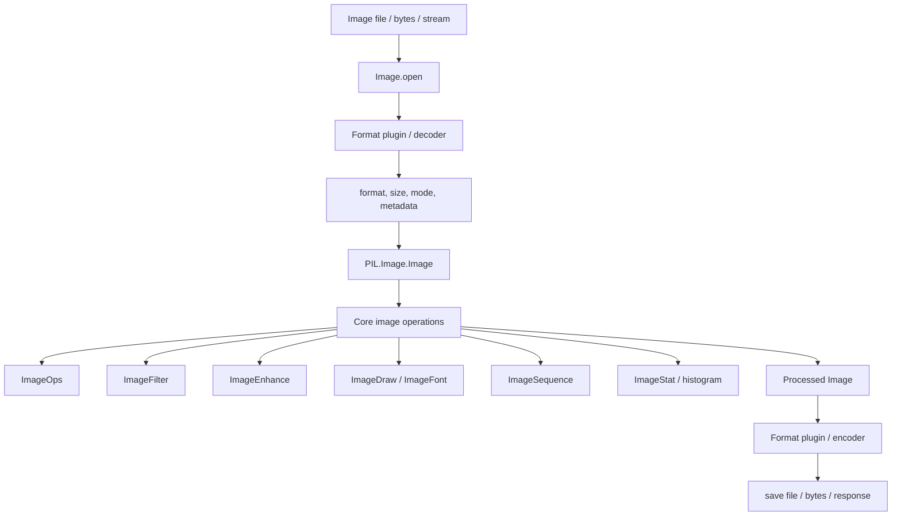
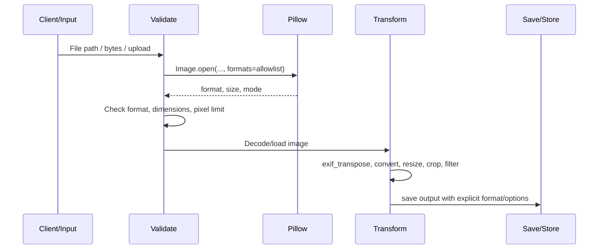
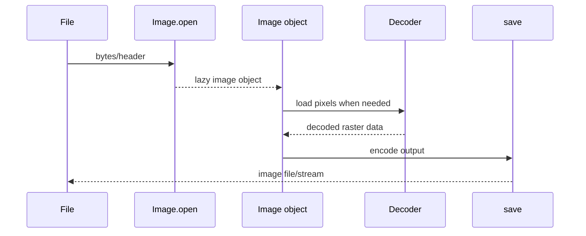

# Pillow: Cơ sở lý thuyết, kiến trúc và thực hành

## 1. Mục tiêu tài liệu

Tài liệu này trình bày Pillow theo hướng lý thuyết kết hợp thực hành, giúp người học nắm được:

- Pillow là gì, vì sao thư viện này được dùng rộng rãi trong xử lý ảnh bằng Python, preprocessing dữ liệu computer vision, tạo thumbnail, chuyển đổi định dạng ảnh và xây dựng pipeline ảnh cho ứng dụng web/API.
- Mối quan hệ giữa Pillow, PIL và package import `PIL`.
- Các khái niệm cốt lõi như pixel, raster image, band, mode, size, coordinate system, palette, alpha channel, metadata, EXIF, resampling filter và lazy loading.
- Cách mở, kiểm tra, tạo mới, chuyển đổi, lưu và đóng ảnh bằng `PIL.Image`.
- Cách resize, crop, rotate, flip, paste, merge, split channel và xử lý transparency.
- Cách dùng `ImageOps`, `ImageFilter`, `ImageEnhance`, `ImageDraw`, `ImageFont`, `ImageSequence` và `ImageStat`.
- Cách tổ chức batch image processing trong project thực tế.
- Các lưu ý về định dạng ảnh, hiệu năng, bảo mật và xử lý ảnh không tin cậy.
- Các lỗi thường gặp khi học và triển khai Pillow.

Tài liệu này tập trung vào Pillow 12.x. Theo tài liệu chính thức và PyPI tại thời điểm viết, Pillow 12.3.0 được phát hành ngày 2026-07-01. Một số API, định dạng được hỗ trợ, tùy chọn encoder/decoder và yêu cầu phiên bản Python có thể thay đổi theo phiên bản Pillow, vì vậy khi làm dự án thực tế nên kiểm tra tài liệu chính thức đúng phiên bản đang dùng.

## 2. Tổng quan về Pillow

Pillow là fork hiện đại của PIL, tức Python Imaging Library. PIL gốc là thư viện xử lý ảnh cho Python; Pillow tiếp tục duy trì API quen thuộc, hỗ trợ Python hiện đại và được dùng như lựa chọn phổ biến khi cần mở, xử lý và lưu ảnh trong Python.

Điểm dễ gây nhầm lẫn:

```python
from PIL import Image
```

Tên package cài bằng pip là `Pillow`, nhưng namespace import vẫn là `PIL` để giữ tương thích với hệ sinh thái PIL cũ.

Pillow thường được dùng trong:

- Đọc và ghi nhiều định dạng ảnh như JPEG, PNG, GIF, TIFF, WebP, BMP, AVIF tùy build và phiên bản.
- Resize ảnh, tạo thumbnail, crop ảnh, xoay ảnh, lật ảnh.
- Chuyển đổi mode màu như `RGB`, `RGBA`, `L`, `CMYK`.
- Xử lý alpha/transparency.
- Vẽ shape, text, watermark, annotation.
- Áp dụng filter như blur, sharpen, edge detection.
- Điều chỉnh brightness, contrast, color, sharpness.
- Đọc EXIF, sửa orientation, xử lý metadata.
- Tách frame từ GIF/WebP/TIFF nhiều frame.
- Tiền xử lý ảnh trước khi đưa vào model computer vision.
- Xử lý ảnh upload trong backend web.

Workflow xử lý ảnh phổ biến với Pillow:

```text
Input image -> Image.open -> Validate -> Decode/load -> Transform -> Save/export -> Store/serve
```

Pillow phù hợp với các tác vụ xử lý ảnh mức ứng dụng: chuyển đổi định dạng, resize, crop, compositing, vẽ text, tạo preview, chuẩn hóa ảnh cho pipeline AI. Với các bài toán computer vision nặng như feature detection, optical flow, camera calibration hoặc xử lý video, OpenCV thường phù hợp hơn.

### 2.1. Đặc điểm nổi bật

| Đặc điểm | Ý nghĩa |
| --- | --- |
| API Python đơn giản | Dễ dùng cho script, notebook, backend và pipeline dữ liệu. |
| `Image` class | Đối tượng trung tâm đại diện cho ảnh raster. |
| Hỗ trợ nhiều định dạng | Đọc/ghi nhiều định dạng ảnh phổ biến thông qua plugin và thư viện C bên dưới. |
| Lazy loading | `Image.open()` đọc header trước, pixel data thường chỉ decode khi cần. |
| Mode và band rõ ràng | Quản lý ảnh grayscale, RGB, RGBA, CMYK, palette, float/int image. |
| Geometry transform | Resize, rotate, transpose, crop, paste, transform. |
| `ImageOps` | Các thao tác dựng sẵn như grayscale, invert, autocontrast, fit, contain, pad. |
| `ImageFilter` | Blur, contour, sharpen, edge enhance, kernel filter. |
| `ImageEnhance` | Điều chỉnh brightness, contrast, color, sharpness bằng factor. |
| `ImageDraw` và `ImageFont` | Vẽ shape, line, rectangle, text, annotation. |
| Multi-frame support | Duyệt frame bằng `ImageSequence` cho GIF, TIFF, WebP/APNG tùy định dạng. |
| Kết hợp tốt với NumPy | Có thể chuyển đổi giữa Pillow image và NumPy array khi cần xử lý số học. |

## 3. Cơ sở lý thuyết

### 3.1. Raster image và pixel

Pillow chủ yếu làm việc với raster image. Raster image là ảnh được biểu diễn bằng lưới pixel.

```text
Image = width x height pixels
Pixel = giá trị màu tại một vị trí (x, y)
```

Ví dụ ảnh RGB 1920x1080 có:

```text
1920 * 1080 = 2,073,600 pixel
```

Mỗi pixel RGB thường có ba kênh:

```text
(R, G, B)
```

Với ảnh RGBA:

```text
(R, G, B, A)
```

Trong đó `A` là alpha channel, thường biểu diễn độ trong suốt.

### 3.2. Band

Band là một kênh dữ liệu trong ảnh.

| Mode | Band |
| --- | --- |
| `L` | `L` |
| `RGB` | `R`, `G`, `B` |
| `RGBA` | `R`, `G`, `B`, `A` |
| `CMYK` | `C`, `M`, `Y`, `K` |
| `LA` | `L`, `A` |

Ví dụ:

```python
from PIL import Image

with Image.open("input.jpg") as im:
    print(im.mode)
    print(im.getbands())
```

Kết quả có thể là:

```text
RGB
('R', 'G', 'B')
```

### 3.3. Mode

`mode` mô tả cách pixel được biểu diễn.

| Mode | Ý nghĩa | Khi dùng |
| --- | --- | --- |
| `1` | 1-bit pixel, đen/trắng | Mask nhị phân, ảnh rất đơn giản. |
| `L` | 8-bit grayscale | Xử lý ảnh xám, mask, luminance. |
| `P` | Palette image | GIF/PNG palette, ảnh ít màu. |
| `RGB` | 3 kênh màu | Ảnh màu phổ biến, JPEG. |
| `RGBA` | RGB + alpha | PNG/WebP có transparency, compositing. |
| `CMYK` | Cyan/Magenta/Yellow/Black | In ấn, pre-press. |
| `YCbCr` | Luma/chroma | JPEG/video-related workflow. |
| `I` | 32-bit signed integer pixel | Một số dữ liệu khoa học/kỹ thuật. |
| `F` | 32-bit floating point pixel | Một số xử lý ảnh số học. |

Mode rất quan trọng vì nhiều thao tác phụ thuộc mode. Ví dụ JPEG không hỗ trợ alpha channel, vì vậy ảnh `RGBA` cần được flatten hoặc convert sang `RGB` trước khi lưu JPEG.

### 3.4. Size

`size` là tuple `(width, height)` tính theo pixel.

```python
from PIL import Image

with Image.open("photo.jpg") as im:
    print(im.size)
    print(im.width)
    print(im.height)
```

Ví dụ:

```text
(1920, 1080)
1920
1080
```

Trong Pillow, thứ tự size là:

```text
(width, height)
```

Điều này khác với nhiều thư viện xử lý array như NumPy/OpenCV, nơi shape thường là:

```text
(height, width, channels)
```

### 3.5. Coordinate system

Pillow dùng hệ tọa độ ảnh với gốc tọa độ ở góc trên bên trái.

```text
(0, 0) -----> x
  |
  |
  v
  y
```

Box thường có dạng:

```text
(left, upper, right, lower)
```

Ví dụ crop vùng 100x100 ở góc trên bên trái:

```python
box = (0, 0, 100, 100)
region = im.crop(box)
```

`right` và `lower` là tọa độ biên phải/dưới, không phải width/height. Vùng `(0, 0, 100, 100)` có kích thước 100x100 pixel.

### 3.6. Alpha channel và transparency

Alpha channel biểu diễn độ trong suốt.

Thông thường:

```text
0   -> trong suốt hoàn toàn
255 -> đục hoàn toàn
```

Ví dụ tạo ảnh RGBA:

```python
from PIL import Image

im = Image.new("RGBA", (300, 200), (255, 0, 0, 128))
im.save("semi_transparent.png")
```

Khi ghép ảnh có transparency, cần phân biệt:

- `paste()` với mask.
- `alpha_composite()` để ghép theo alpha channel.
- Convert `RGBA` sang `RGB` trước khi lưu JPEG.

### 3.7. Palette

Ảnh mode `P` dùng bảng màu. Pixel không lưu trực tiếp `(R, G, B)` mà lưu index trỏ đến palette.

Palette thường gặp trong:

- GIF.
- PNG palette.
- Ảnh icon hoặc ảnh ít màu.

Khi cần xử lý màu trực tiếp, thường convert sang `RGB` hoặc `RGBA`:

```python
with Image.open("palette_image.gif") as im:
    rgb = im.convert("RGB")
```

### 3.8. Metadata, EXIF và orientation

Ảnh có thể chứa metadata:

- EXIF từ camera/điện thoại.
- ICC profile.
- DPI.
- Comment.
- XMP/IPTC tùy định dạng.

Một lỗi thực tế phổ biến là ảnh chụp từ điện thoại hiển thị đúng trong viewer nhưng khi xử lý bằng code lại bị xoay sai. Lý do thường là ảnh lưu pixel theo một hướng nhưng dùng EXIF Orientation để báo viewer xoay khi hiển thị.

Pillow cung cấp `ImageOps.exif_transpose()` để áp dụng orientation vào pixel:

```python
from PIL import Image, ImageOps

with Image.open("phone_photo.jpg") as im:
    im = ImageOps.exif_transpose(im)
    im.save("normalized.jpg")
```

Trong pipeline upload ảnh, nên xử lý EXIF orientation sớm để các bước crop/resize sau đó nhất quán.

### 3.9. Resampling filter

Khi resize hoặc transform ảnh, một pixel output có thể được tính từ nhiều pixel input. Resampling filter quyết định cách tính này.

| Filter | Đặc điểm | Khi dùng |
| --- | --- | --- |
| `Image.Resampling.NEAREST` | Nhanh, chọn pixel gần nhất, chất lượng thấp khi scale ảnh tự nhiên. | Mask, label map, pixel art. |
| `Image.Resampling.BOX` | Phù hợp một số downscale, nhanh hơn filter chất lượng cao. | Thumbnail đơn giản. |
| `Image.Resampling.BILINEAR` | Nội suy tuyến tính, cân bằng tốc độ/chất lượng. | Resize nhanh. |
| `Image.Resampling.BICUBIC` | Chất lượng tốt hơn bilinear, chậm hơn. | Resize ảnh tự nhiên. |
| `Image.Resampling.LANCZOS` | Chất lượng cao khi resize, đặc biệt downscale. | Thumbnail/preview chất lượng cao. |

Ví dụ:

```python
from PIL import Image

with Image.open("input.jpg") as im:
    out = im.resize((800, 600), resample=Image.Resampling.LANCZOS)
    out.save("resized.jpg")
```

### 3.10. Lazy loading

`Image.open()` thường đọc header trước để biết format, size, mode và metadata cần thiết. Pixel data có thể chưa được decode ngay.

Điều này giúp mở ảnh nhanh, nhưng cũng tạo ra vài lưu ý:

- Nên dùng context manager `with Image.open(...) as im:`.
- Nếu cần giữ ảnh sau khi file đã đóng, dùng `im.copy()` hoặc đảm bảo pixel đã load.
- Lỗi decode có thể xuất hiện ở bước `load()`, `resize()`, `save()` chứ không nhất thiết ngay tại `Image.open()`.

Ví dụ:

```python
from PIL import Image

with Image.open("input.jpg") as im:
    im.load()
    work = im.copy()

print(work.size)
```

## 4. Kiến trúc Pillow

### 4.1. Sơ đồ kiến trúc Mermaid



Pillow tách các phần khá rõ:

- `PIL.Image` cho mở, tạo, biến đổi và lưu ảnh.
- Format plugins cho encoder/decoder theo từng định dạng.
- `ImageOps` cho thao tác ảnh dựng sẵn.
- `ImageFilter` cho filter/convolution.
- `ImageEnhance` cho điều chỉnh ảnh theo factor.
- `ImageDraw` và `ImageFont` cho vẽ 2D và text.
- `ImageSequence` cho ảnh nhiều frame.
- `ImageStat`, `ImageChops` cho thống kê và thao tác channel.
- C extension và thư viện bên ngoài như libjpeg, zlib, libtiff, libwebp, freetype, littlecms, openjpeg tùy tính năng và build.

### 4.2. Các thành phần quan trọng

| Thành phần | Vai trò |
| --- | --- |
| `PIL.Image.Image` | Class chính đại diện cho ảnh. |
| `Image.open()` | Mở ảnh từ file path hoặc file-like object. |
| `Image.new()` | Tạo ảnh mới từ mode, size và color. |
| `Image.fromarray()` | Tạo Pillow image từ NumPy array. |
| `Image.save()` | Lưu ảnh ra file hoặc stream. |
| `Image.convert()` | Chuyển mode màu. |
| `Image.resize()` | Resize về kích thước mới. |
| `Image.thumbnail()` | Tạo thumbnail in-place, giữ aspect ratio. |
| `Image.crop()` | Cắt vùng ảnh. |
| `Image.paste()` | Dán vùng/ảnh khác vào ảnh hiện tại. |
| `Image.transpose()` | Lật/xoay 90/180/270 bằng enum. |
| `Image.rotate()` | Xoay theo góc bất kỳ. |
| `ImageOps` | Grayscale, invert, autocontrast, contain, cover, fit, pad, exif transpose. |
| `ImageFilter` | Blur, sharpen, contour, edge enhance, kernel. |
| `ImageEnhance` | Brightness, contrast, color, sharpness. |
| `ImageDraw` | Vẽ line, rectangle, ellipse, polygon, text. |
| `ImageFont` | Load font bitmap/OpenType/TrueType. |
| `ImageSequence` | Duyệt frame trong ảnh nhiều frame. |
| `ImageStat` | Tính mean, median, extrema, histogram-related statistics. |

## 5. Vòng đời xử lý ảnh

### 5.1. Luồng xử lý tổng quan



Trong một pipeline thực tế:

1. Nhận ảnh từ file, upload hoặc object storage.
2. Giới hạn file size trước khi đọc.
3. Mở bằng `Image.open()`.
4. Kiểm tra format, mode, size, số pixel.
5. Áp dụng EXIF orientation.
6. Convert mode nếu cần.
7. Resize/crop/filter/enhance/draw.
8. Strip hoặc giữ metadata có chủ đích.
9. Lưu với format và encoder options rõ ràng.
10. Log output path, format, size và lỗi nếu có.

### 5.2. Luồng đọc và ghi ảnh



Lưu ý:

- `Image.open()` không chỉ dựa vào extension; Pillow sniff nội dung file để xác định format.
- Khi lưu ra file object thay vì filename, nên truyền `format="PNG"` hoặc format tương ứng.
- Encoder options khác nhau theo định dạng, ví dụ `quality`, `optimize`, `progressive` cho JPEG.

## 6. Các khái niệm cốt lõi

### 6.1. Mở ảnh

```python
from PIL import Image

with Image.open("input.jpg") as im:
    print(im.format)
    print(im.size)
    print(im.mode)
```

Các thuộc tính hay dùng:

| Thuộc tính | Ý nghĩa |
| --- | --- |
| `format` | Định dạng nguồn như `JPEG`, `PNG`; có thể là `None` với ảnh tạo trong memory. |
| `size` | `(width, height)`. |
| `mode` | Cách biểu diễn pixel như `RGB`, `RGBA`, `L`. |
| `width` | Chiều rộng. |
| `height` | Chiều cao. |
| `info` | Dictionary metadata/format-specific info. |
| `is_animated` | Có phải ảnh nhiều frame không, nếu thuộc tính tồn tại. |
| `n_frames` | Số frame, nếu định dạng hỗ trợ. |

### 6.2. Tạo ảnh mới

```python
from PIL import Image

canvas = Image.new("RGB", (800, 600), "white")
canvas.save("blank.jpg")
```

Tạo ảnh RGBA trong suốt:

```python
from PIL import Image

overlay = Image.new("RGBA", (800, 600), (0, 0, 0, 0))
overlay.save("transparent.png")
```

### 6.3. Lưu ảnh

```python
from PIL import Image

with Image.open("input.png") as im:
    im.save("output.webp")
```

Nếu filename không có extension chuẩn hoặc lưu vào stream, truyền format rõ ràng:

```python
from io import BytesIO
from PIL import Image

buffer = BytesIO()

with Image.open("input.png") as im:
    im.save(buffer, format="PNG")

data = buffer.getvalue()
```

### 6.4. Convert mode

Chuyển ảnh sang grayscale:

```python
from PIL import Image

with Image.open("input.jpg") as im:
    gray = im.convert("L")
    gray.save("gray.png")
```

Chuyển ảnh sang RGB trước khi lưu JPEG:

```python
from PIL import Image

with Image.open("input.png") as im:
    rgb = im.convert("RGB")
    rgb.save("output.jpg", quality=90)
```

Nếu ảnh có alpha và cần nền trắng:

```python
from PIL import Image

with Image.open("logo.png").convert("RGBA") as im:
    background = Image.new("RGBA", im.size, "white")
    flattened = Image.alpha_composite(background, im).convert("RGB")
    flattened.save("logo.jpg", quality=90)
```

### 6.5. Resize

Resize trực tiếp:

```python
from PIL import Image

with Image.open("input.jpg") as im:
    resized = im.resize((640, 360), Image.Resampling.LANCZOS)
    resized.save("resized.jpg", quality=90)
```

Giữ aspect ratio bằng `thumbnail()`:

```python
from PIL import Image

with Image.open("input.jpg") as im:
    im.thumbnail((300, 300), Image.Resampling.LANCZOS)
    im.save("thumbnail.jpg", quality=90)
```

Điểm khác nhau:

| API | Hành vi |
| --- | --- |
| `resize()` | Trả về ảnh mới, có thể thay đổi aspect ratio nếu size không đúng tỷ lệ. |
| `thumbnail()` | Sửa ảnh hiện tại in-place, giữ aspect ratio và không vượt quá box cho trước. |
| `ImageOps.contain()` | Trả về ảnh nằm gọn trong size, giữ aspect ratio. |
| `ImageOps.cover()` | Trả về ảnh phủ kín size, giữ aspect ratio, có thể vượt size rồi crop. |
| `ImageOps.fit()` | Resize/crop để vừa đúng size. |
| `ImageOps.pad()` | Resize giữ ratio rồi thêm nền để vừa size. |

### 6.6. Crop

```python
from PIL import Image

with Image.open("input.jpg") as im:
    box = (100, 50, 500, 350)
    region = im.crop(box)
    region.save("crop.jpg")
```

Box:

```text
(left, upper, right, lower)
```

Kích thước output:

```text
(right - left, lower - upper)
```

### 6.7. Paste và mask

```python
from PIL import Image

with Image.open("background.jpg").convert("RGBA") as bg:
    with Image.open("logo.png").convert("RGBA") as logo:
        position = (bg.width - logo.width - 20, bg.height - logo.height - 20)
        bg.paste(logo, position, logo)
        bg.save("watermarked.png")
```

Tham số thứ ba của `paste()` là mask. Với ảnh `RGBA`, có thể dùng chính ảnh đó làm mask để giữ transparency.

### 6.8. Rotate, transpose và flip

Xoay góc bất kỳ:

```python
from PIL import Image

with Image.open("input.jpg") as im:
    rotated = im.rotate(30, expand=True, fillcolor="white")
    rotated.save("rotated.jpg")
```

Lật ngang:

```python
from PIL import Image

with Image.open("input.jpg") as im:
    flipped = im.transpose(Image.Transpose.FLIP_LEFT_RIGHT)
    flipped.save("flipped.jpg")
```

Các thao tác `transpose()` phổ biến:

| Enum | Ý nghĩa |
| --- | --- |
| `Image.Transpose.FLIP_LEFT_RIGHT` | Lật ngang. |
| `Image.Transpose.FLIP_TOP_BOTTOM` | Lật dọc. |
| `Image.Transpose.ROTATE_90` | Xoay 90 độ. |
| `Image.Transpose.ROTATE_180` | Xoay 180 độ. |
| `Image.Transpose.ROTATE_270` | Xoay 270 độ. |

### 6.9. Split và merge channel

```python
from PIL import Image

with Image.open("input.jpg").convert("RGB") as im:
    r, g, b = im.split()
    swapped = Image.merge("RGB", (b, g, r))
    swapped.save("swapped.jpg")
```

`split()` tách ảnh nhiều band thành các ảnh một band. `merge()` ghép các band thành ảnh mới theo mode cho trước.

### 6.10. Filter

```python
from PIL import Image, ImageFilter

with Image.open("input.jpg") as im:
    blurred = im.filter(ImageFilter.GaussianBlur(radius=3))
    sharpened = im.filter(ImageFilter.SHARPEN)

    blurred.save("blurred.jpg")
    sharpened.save("sharpened.jpg")
```

Một số filter phổ biến:

| Filter | Ý nghĩa |
| --- | --- |
| `ImageFilter.BLUR` | Làm mờ cơ bản. |
| `ImageFilter.GaussianBlur(radius)` | Làm mờ Gaussian. |
| `ImageFilter.SHARPEN` | Tăng sắc nét. |
| `ImageFilter.EDGE_ENHANCE` | Tăng cạnh. |
| `ImageFilter.FIND_EDGES` | Tìm cạnh đơn giản. |
| `ImageFilter.CONTOUR` | Tạo hiệu ứng contour. |
| `ImageFilter.EMBOSS` | Tạo hiệu ứng nổi. |
| `ImageFilter.Kernel(...)` | Custom convolution kernel. |

### 6.11. Enhance

```python
from PIL import Image, ImageEnhance

with Image.open("input.jpg") as im:
    contrast = ImageEnhance.Contrast(im).enhance(1.25)
    brightness = ImageEnhance.Brightness(contrast).enhance(1.10)
    color = ImageEnhance.Color(brightness).enhance(1.15)

    color.save("enhanced.jpg", quality=90)
```

Các class chính:

| Class | Ý nghĩa |
| --- | --- |
| `ImageEnhance.Color` | Điều chỉnh độ bão hòa màu. |
| `ImageEnhance.Contrast` | Điều chỉnh tương phản. |
| `ImageEnhance.Brightness` | Điều chỉnh độ sáng. |
| `ImageEnhance.Sharpness` | Điều chỉnh độ sắc nét. |

Factor:

```text
0.0 -> giảm tối đa theo loại enhancer
1.0 -> ảnh gốc
>1.0 -> tăng hiệu ứng
```

### 6.12. ImageOps

```python
from PIL import Image, ImageOps

with Image.open("input.jpg") as im:
    im = ImageOps.exif_transpose(im)
    square = ImageOps.fit(im, (512, 512), method=Image.Resampling.LANCZOS)
    square = ImageOps.autocontrast(square)
    square.save("square.jpg", quality=90)
```

Một số thao tác thường dùng:

| API | Ý nghĩa |
| --- | --- |
| `ImageOps.exif_transpose()` | Áp dụng EXIF orientation. |
| `ImageOps.grayscale()` | Chuyển sang grayscale. |
| `ImageOps.invert()` | Đảo màu. |
| `ImageOps.autocontrast()` | Tự động kéo contrast theo histogram. |
| `ImageOps.equalize()` | Histogram equalization. |
| `ImageOps.mirror()` | Lật ngang. |
| `ImageOps.flip()` | Lật dọc. |
| `ImageOps.contain()` | Resize giữ ratio để nằm trong khung. |
| `ImageOps.fit()` | Resize/crop để vừa khung. |
| `ImageOps.pad()` | Resize rồi thêm nền. |

### 6.13. ImageDraw và ImageFont

```python
from PIL import Image, ImageDraw, ImageFont

im = Image.new("RGB", (800, 400), "white")
draw = ImageDraw.Draw(im)

draw.rectangle((40, 40, 760, 360), outline="black", width=4)
draw.line((40, 360, 760, 40), fill="red", width=3)
draw.ellipse((320, 120, 480, 280), fill="#4f46e5")

font = ImageFont.load_default()
draw.text((60, 60), "Pillow annotation", fill="black", font=font)

im.save("drawing.png")
```

`ImageDraw` dùng cùng hệ tọa độ với Pillow: `(0, 0)` ở góc trên bên trái.

### 6.14. Text với alpha

Khi cần text bán trong suốt, cách ổn định là vẽ lên layer RGBA rồi alpha composite.

```python
from PIL import Image, ImageDraw, ImageFont

with Image.open("input.jpg").convert("RGBA") as base:
    overlay = Image.new("RGBA", base.size, (0, 0, 0, 0))
    draw = ImageDraw.Draw(overlay)
    font = ImageFont.load_default()

    draw.rectangle((20, 20, 260, 70), fill=(0, 0, 0, 120))
    draw.text((35, 35), "CONFIDENTIAL", fill=(255, 255, 255, 220), font=font)

    out = Image.alpha_composite(base, overlay)
    out.save("annotated.png")
```

### 6.15. Multi-frame image

Một số định dạng có nhiều frame như GIF, TIFF, WebP/APNG tùy hỗ trợ.

```python
from PIL import Image, ImageSequence

with Image.open("animation.gif") as im:
    for index, frame in enumerate(ImageSequence.Iterator(im)):
        frame.save(f"frame_{index:03d}.png")
```

Kiểm tra:

```python
with Image.open("animation.gif") as im:
    print(getattr(im, "is_animated", False))
    print(getattr(im, "n_frames", 1))
```

### 6.16. Histogram và thống kê đơn giản

```python
from PIL import Image, ImageStat

with Image.open("input.jpg").convert("RGB") as im:
    stat = ImageStat.Stat(im)
    print(stat.mean)
    print(stat.extrema)
```

`ImageStat` hữu ích khi cần kiểm tra ảnh quá tối, quá sáng, gần như trống hoặc tính thống kê đơn giản trước khi xử lý tiếp.

### 6.17. Kết hợp với NumPy

Pillow có thể chuyển đổi với NumPy khi cần xử lý số học lớn.

```python
import numpy as np
from PIL import Image

with Image.open("input.jpg").convert("RGB") as im:
    arr = np.array(im)

print(arr.shape)  # (height, width, channels)

arr = 255 - arr
out = Image.fromarray(arr.astype("uint8"), "RGB")
out.save("inverted.jpg")
```

Lưu ý khác biệt thứ tự:

| Pillow | NumPy/OpenCV thường gặp |
| --- | --- |
| `im.size == (width, height)` | `arr.shape == (height, width, channels)` |
| RGB phổ biến | OpenCV mặc định BGR |

## 7. Cài đặt và cấu hình

### 7.1. Cài Pillow

Cài bằng pip:

```bash
python -m pip install --upgrade pip
python -m pip install --upgrade Pillow
```

Kiểm tra version:

```bash
python -c "import PIL; print(PIL.__version__)"
```

Import thử:

```bash
python -c "from PIL import Image; print(Image)"
```

### 7.2. Tạo môi trường Python

Với `venv`:

```bash
python -m venv .venv
.venv\Scripts\activate
python -m pip install --upgrade pip
python -m pip install Pillow
```

Trên macOS/Linux:

```bash
python -m venv .venv
source .venv/bin/activate
python -m pip install --upgrade pip
python -m pip install Pillow
```

Trong project thực tế nên pin dependency:

```text
Pillow==12.3.0
```

Hoặc dùng constraint/lock file theo công cụ quản lý dependency của project.

### 7.3. Kiểm tra feature hỗ trợ

Một số định dạng phụ thuộc build và thư viện bên ngoài.

```python
from PIL import features

for feature in ["jpg", "jpg_2000", "zlib", "libtiff", "webp", "raqm"]:
    print(feature, features.check(feature))
```

Kiểm tra module:

```python
from PIL import features

print(features.pilinfo())
```

Khi deploy production, nên kiểm tra image Docker hoặc môi trường runtime có hỗ trợ đúng format cần dùng, đặc biệt WebP, AVIF, JPEG 2000, TIFF, font rendering hoặc color management.

## 8. Ví dụ Pillow cơ bản

### 8.1. Đọc thông tin ảnh

```python
from pathlib import Path
from PIL import Image

path = Path("input.jpg")

with Image.open(path) as im:
    print("format:", im.format)
    print("size:", im.size)
    print("mode:", im.mode)
    print("bands:", im.getbands())
```

### 8.2. Convert PNG sang JPEG

```python
from PIL import Image

with Image.open("input.png") as im:
    im = im.convert("RGBA")
    background = Image.new("RGBA", im.size, "white")
    out = Image.alpha_composite(background, im).convert("RGB")
    out.save("output.jpg", quality=90, optimize=True)
```

### 8.3. Tạo thumbnail

```python
from PIL import Image, ImageOps

with Image.open("input.jpg") as im:
    im = ImageOps.exif_transpose(im)
    im.thumbnail((256, 256), Image.Resampling.LANCZOS)
    im.save("thumbnail.jpg", quality=85)
```

### 8.4. Crop trung tâm

```python
from PIL import Image

def center_crop(im: Image.Image, size: tuple[int, int]) -> Image.Image:
    target_w, target_h = size
    left = (im.width - target_w) // 2
    top = (im.height - target_h) // 2
    return im.crop((left, top, left + target_w, top + target_h))


with Image.open("input.jpg") as im:
    crop = center_crop(im, (512, 512))
    crop.save("center_crop.jpg", quality=90)
```

### 8.5. Resize vừa khung với nền

```python
from PIL import Image, ImageOps

with Image.open("input.jpg") as im:
    out = ImageOps.pad(
        im,
        (512, 512),
        method=Image.Resampling.LANCZOS,
        color="white",
    )
    out.save("padded.jpg", quality=90)
```

### 8.6. Watermark text

```python
from PIL import Image, ImageDraw, ImageFont

with Image.open("input.jpg").convert("RGBA") as base:
    overlay = Image.new("RGBA", base.size, (0, 0, 0, 0))
    draw = ImageDraw.Draw(overlay)
    font = ImageFont.load_default()

    text = "demo"
    x = base.width - 120
    y = base.height - 50
    draw.text((x, y), text, fill=(255, 255, 255, 180), font=font)

    out = Image.alpha_composite(base, overlay)
    out.convert("RGB").save("watermarked.jpg", quality=90)
```

### 8.7. Batch convert ảnh

```python
from pathlib import Path
from PIL import Image, ImageOps

input_dir = Path("images")
output_dir = Path("output")
output_dir.mkdir(exist_ok=True)

for path in input_dir.glob("*"):
    if path.suffix.lower() not in {".jpg", ".jpeg", ".png", ".webp"}:
        continue

    try:
        with Image.open(path) as im:
            im = ImageOps.exif_transpose(im)
            im = im.convert("RGB")
            out_path = output_dir / f"{path.stem}.jpg"
            im.save(out_path, quality=90, optimize=True)
    except OSError as exc:
        print(f"skip {path}: {exc}")
```

## 9. Pipeline xử lý ảnh hoàn chỉnh

### 9.1. Mục tiêu pipeline

Pipeline này nhận ảnh đầu vào, kiểm tra format, áp dụng EXIF orientation, resize để tạo ảnh preview, strip metadata không cần thiết và lưu ra JPEG.

```text
Input -> open -> validate -> exif_transpose -> convert RGB -> resize -> save JPEG
```

### 9.2. Code hoàn chỉnh

```python
from pathlib import Path
from PIL import Image, ImageOps, UnidentifiedImageError


ALLOWED_FORMATS = {"JPEG", "PNG", "WEBP"}
MAX_WIDTH = 1280
MAX_HEIGHT = 1280


def process_image(input_path: Path, output_path: Path) -> None:
    try:
        with Image.open(input_path, formats=list(ALLOWED_FORMATS)) as im:
            if im.format not in ALLOWED_FORMATS:
                raise ValueError(f"unsupported format: {im.format}")

            if im.width <= 0 or im.height <= 0:
                raise ValueError("invalid image size")

            im = ImageOps.exif_transpose(im)
            im = im.convert("RGB")

            im.thumbnail(
                (MAX_WIDTH, MAX_HEIGHT),
                resample=Image.Resampling.LANCZOS,
            )

            output_path.parent.mkdir(parents=True, exist_ok=True)
            im.save(
                output_path,
                format="JPEG",
                quality=88,
                optimize=True,
                progressive=True,
                exif=b"",
                icc_profile=None,
            )

    except UnidentifiedImageError as exc:
        raise ValueError(f"not an image or unsupported image: {input_path}") from exc
    except OSError as exc:
        raise ValueError(f"cannot process image: {input_path}") from exc


if __name__ == "__main__":
    process_image(Path("input.png"), Path("out/preview.jpg"))
```

### 9.3. Giải thích

| Bước | Ý nghĩa |
| --- | --- |
| `formats=list(ALLOWED_FORMATS)` | Giới hạn decoder được phép dùng. |
| Kiểm tra `im.format` | Đảm bảo format thực tế đúng kỳ vọng. |
| `ImageOps.exif_transpose()` | Sửa orientation từ EXIF. |
| `convert("RGB")` | Chuẩn hóa output để lưu JPEG. |
| `thumbnail()` | Giữ aspect ratio và giới hạn kích thước tối đa. |
| `quality`, `optimize`, `progressive` | Tùy chọn JPEG thường dùng cho web. |
| `exif=b""`, `icc_profile=None` | Không ghi metadata nhạy cảm nếu không cần. |

## 10. Đọc, ghi và định dạng ảnh

### 10.1. Chọn định dạng output

| Định dạng | Điểm mạnh | Điểm yếu | Khi dùng |
| --- | --- | --- | --- |
| JPEG | Nhỏ, phổ biến, tốt cho ảnh chụp. | Lossy, không hỗ trợ alpha. | Ảnh chụp, preview, web gallery. |
| PNG | Lossless, hỗ trợ alpha tốt. | File lớn với ảnh chụp. | Logo, UI asset, ảnh cần transparency. |
| WebP | Nén tốt, hỗ trợ lossy/lossless/alpha. | Cần kiểm tra hỗ trợ môi trường. | Web image hiện đại. |
| GIF | Animation đơn giản, palette. | Màu hạn chế, nén kém cho ảnh chụp. | Animation đơn giản, legacy. |
| TIFF | Linh hoạt, nhiều frame, dùng trong scan/khoa học. | File lớn, nhiều biến thể. | Scan, archival, workflow kỹ thuật. |
| BMP | Đơn giản. | File lớn. | Tương thích legacy. |

### 10.2. JPEG options

```python
with Image.open("input.jpg") as im:
    im = im.convert("RGB")
    im.save(
        "output.jpg",
        quality=90,
        optimize=True,
        progressive=True,
    )
```

Lưu ý:

- `quality` càng cao thì file càng lớn.
- JPEG là lossy; lưu lại nhiều lần có thể làm giảm chất lượng.
- JPEG không hỗ trợ alpha channel.
- Không nên dùng JPEG cho mask, label map hoặc ảnh cần pixel-perfect.

### 10.3. PNG options

```python
with Image.open("input.png") as im:
    im.save("output.png", optimize=True)
```

PNG phù hợp cho:

- Ảnh có transparency.
- Logo, icon, UI asset.
- Ảnh cần lossless.
- Mask hoặc label map.

### 10.4. WebP options

```python
with Image.open("input.png") as im:
    im.save("output.webp", quality=85, method=6)
```

Trước khi dùng WebP trong production, nên kiểm tra:

```python
from PIL import features

print(features.check("webp"))
```

### 10.5. Lưu ảnh nhiều frame

Ví dụ lưu GIF từ nhiều frame:

```python
from PIL import Image

frames = [
    Image.new("RGB", (200, 200), "red"),
    Image.new("RGB", (200, 200), "green"),
    Image.new("RGB", (200, 200), "blue"),
]

frames[0].save(
    "animation.gif",
    save_all=True,
    append_images=frames[1:],
    duration=300,
    loop=0,
)
```

## 11. Bảo mật và xử lý ảnh không tin cậy

### 11.1. Attack surface

Ảnh upload từ user là dữ liệu không tin cậy. Rủi ro chính:

- File giả extension, ví dụ tên `.png` nhưng nội dung là format khác.
- Decompression bomb: file nén nhỏ nhưng bung ra rất lớn trong memory.
- Metadata chứa dữ liệu nhạy cảm hoặc payload nguy hiểm cho hệ thống khác.
- Parser lỗi hoặc thư viện C bên dưới có CVE.
- EPS/PostScript có thể cần Ghostscript, vốn là bề mặt tấn công nhạy cảm.
- Animation/multi-frame có quá nhiều frame gây tốn CPU/memory.

### 11.2. Nguyên tắc an toàn

| Nguyên tắc | Lý do |
| --- | --- |
| Giới hạn file size trước khi đọc | Tránh file quá lớn ngay từ đầu. |
| Dùng allowlist format | Chỉ parse định dạng thật sự cần. |
| Kiểm tra `format`, `size`, số pixel | Tránh ảnh quá lớn hoặc không hợp lệ. |
| Không tắt `Image.MAX_IMAGE_PIXELS` trong production | Giữ cơ chế cảnh báo decompression bomb. |
| Treat metadata as untrusted | Metadata có thể chứa dữ liệu nhạy cảm hoặc chuỗi độc hại cho hệ thống khác. |
| Strip metadata nếu không cần | Giảm rò rỉ EXIF/GPS/author/comment. |
| Chạy worker xử lý ảnh trong sandbox/container | Giảm blast radius nếu parser hoặc thư viện C có lỗi. |
| Pin và cập nhật dependency | Pillow phụ thuộc nhiều thư viện xử lý binary data. |

### 11.3. Chuyển warning decompression bomb thành error

```python
import warnings
from PIL import Image

warnings.simplefilter("error", Image.DecompressionBombWarning)
```

Không nên làm trong production:

```python
Image.MAX_IMAGE_PIXELS = None
```

Trừ khi bạn kiểm soát hoàn toàn dữ liệu đầu vào và có giới hạn memory/process riêng.

### 11.4. Validate ảnh upload

```python
from pathlib import Path
from PIL import Image, UnidentifiedImageError


ALLOWED_FORMATS = {"JPEG", "PNG", "WEBP"}
MAX_PIXELS = 20_000_000


def validate_image(path: Path) -> tuple[str, tuple[int, int]]:
    try:
        with Image.open(path, formats=list(ALLOWED_FORMATS)) as im:
            if im.format not in ALLOWED_FORMATS:
                raise ValueError(f"unsupported format: {im.format}")

            pixels = im.width * im.height
            if pixels > MAX_PIXELS:
                raise ValueError(f"image too large: {pixels} pixels")

            im.verify()
            return im.format, im.size

    except UnidentifiedImageError as exc:
        raise ValueError("unidentified image") from exc
```

Sau `verify()`, nếu cần xử lý ảnh tiếp thì mở lại file, vì `verify()` dùng để kiểm tra tính hợp lệ chứ không phải để tiếp tục transform trên cùng object.

## 12. Pillow trong hệ thống thực tế

### 12.1. Pillow và FastAPI

Luồng upload ảnh phổ biến:

```text
Client -> FastAPI -> validate upload -> Pillow processing -> object storage/CDN -> response URL
```

Lưu ý:

- Giới hạn kích thước upload ở web server/API gateway.
- Đọc bytes vào `BytesIO` khi cần xử lý in-memory.
- Không block event loop với xử lý CPU nặng; dùng worker thread/process hoặc queue.
- Log format, size, output size và thời gian xử lý.
- Strip metadata nếu ảnh public.

Ví dụ xử lý bytes:

```python
from io import BytesIO
from PIL import Image, ImageOps


def make_preview(data: bytes) -> bytes:
    with Image.open(BytesIO(data), formats=["JPEG", "PNG", "WEBP"]) as im:
        im = ImageOps.exif_transpose(im)
        im = im.convert("RGB")
        im.thumbnail((512, 512), Image.Resampling.LANCZOS)

        out = BytesIO()
        im.save(out, format="JPEG", quality=85, optimize=True)
        return out.getvalue()
```

### 12.2. Pillow và computer vision

Trong ML/computer vision, Pillow thường xuất hiện ở bước preprocessing:

```text
Image file -> Pillow open/resize/crop/convert -> NumPy/Tensor -> Model
```

Các thao tác thường gặp:

- Convert `RGB`.
- Resize/crop về kích thước model yêu cầu.
- Đọc ảnh từ dataset folder.
- Augmentation đơn giản.
- Chuyển sang NumPy array hoặc tensor.

Lưu ý:

- Không dùng JPEG cho segmentation mask vì JPEG là lossy.
- Với mask/label map, dùng `NEAREST` khi resize để không tạo label trung gian.
- Với ảnh tự nhiên, dùng `BILINEAR`, `BICUBIC` hoặc `LANCZOS` tùy mục tiêu.

### 12.3. Pillow và batch data pipeline

Pipeline batch:

```text
Raw images -> validate -> normalize orientation -> resize -> write processed -> manifest CSV/JSON
```

Cấu trúc log nên có:

- Input path.
- Output path.
- Format.
- Original size.
- Output size.
- Duration.
- Error message nếu fail.

### 12.4. Pillow và Docker

Khi dùng Pillow trong Docker:

- Ưu tiên wheel chính thức nếu đủ tính năng.
- Nếu build từ source, cần cài system libraries tương ứng.
- Kiểm tra `features.pilinfo()` trong image build hoặc startup.
- Pin version để tránh output khác nhau giữa các lần build.
- Với xử lý ảnh upload, đặt memory limit/container limit.

## 13. So sánh Pillow với công cụ khác

### 13.1. Pillow và OpenCV

| Tiêu chí | Pillow | OpenCV |
| --- | --- | --- |
| Mục tiêu | Image manipulation mức ứng dụng | Computer vision và xử lý ảnh/video hiệu năng cao |
| API | Pythonic, dễ dùng | Rộng, nhiều thuật toán CV |
| Màu mặc định | RGB | BGR |
| Định dạng web | Rất thuận tiện | Có hỗ trợ nhưng không phải trọng tâm duy nhất |
| Vẽ text đơn giản | Dễ với `ImageDraw`/`ImageFont` | Có nhưng font/Unicode phức tạp hơn |
| Video/camera | Không phải trọng tâm | Rất mạnh |
| ML preprocessing | Tốt cho bước đơn giản | Tốt khi cần CV thuật toán hoặc hiệu năng |

Pillow phù hợp khi cần mở/lưu/resize/crop/vẽ/composite ảnh. OpenCV phù hợp khi cần xử lý ảnh thuật toán sâu, video, camera hoặc realtime pipeline.

### 13.2. Pillow và scikit-image

| Tiêu chí | Pillow | scikit-image |
| --- | --- | --- |
| Trọng tâm | Image IO và manipulation thực dụng | Image processing khoa học trên NumPy |
| Data structure | `PIL.Image.Image` | NumPy array |
| Dễ dùng cho web/backend | Rất tốt | Có thể dùng nhưng không phải trọng tâm |
| Thuật toán xử lý ảnh | Cơ bản | Phong phú hơn cho scientific image processing |
| Metadata/format handling | Mạnh ở mức ứng dụng | Tùy backend IO |

Nếu cần segmentation, morphology, thresholding nâng cao hoặc thuật toán khoa học, scikit-image thường phù hợp hơn. Nếu cần thumbnail, format conversion, annotation và upload processing, Pillow thường đơn giản hơn.

### 13.3. Pillow và ImageMagick

| Tiêu chí | Pillow | ImageMagick |
| --- | --- | --- |
| Cách dùng | Python library | CLI và library hệ thống |
| Tích hợp Python | Trực tiếp | Qua subprocess hoặc binding |
| Batch conversion | Tốt trong Python | Rất mạnh qua CLI |
| Deployment | Cài package Python | Cần binary/system dependency |
| Kiểm soát logic ứng dụng | Dễ trong code Python | Cần quản lý command và escaping |

ImageMagick mạnh cho xử lý ảnh CLI quy mô lớn. Pillow thuận tiện khi logic xử lý nằm trong Python application.

### 13.4. Pillow và torchvision transforms

| Tiêu chí | Pillow | torchvision |
| --- | --- | --- |
| Mục tiêu | Xử lý ảnh tổng quát | Preprocessing/augmentation cho PyTorch |
| Output | `Image` hoặc file | Tensor hoặc transformed image |
| Training augmentation | Cơ bản nếu tự viết | Rất phù hợp |
| Format conversion | Mạnh | Không phải trọng tâm |
| Backend app | Phù hợp | Thường nặng hơn nếu chỉ xử lý ảnh đơn giản |

Trong PyTorch pipeline, Pillow có thể dùng để đọc ảnh, còn torchvision transforms dùng để chuẩn hóa và augmentation trước khi đưa vào model.

## 14. Tổ chức project Pillow

### 14.1. Cấu trúc project đề xuất

```text
project/
  data/
    raw/
    processed/
  src/
    image_processing/
      __init__.py
      validate.py
      transforms.py
      thumbnails.py
      metadata.py
      batch.py
    config.py
  tests/
    test_validate.py
    test_transforms.py
  scripts/
    batch_resize.py
  README.md
```

Ý nghĩa:

| Thư mục/file | Vai trò |
| --- | --- |
| `data/raw` | Ảnh gốc, thường không commit nếu lớn. |
| `data/processed` | Ảnh đã xử lý. |
| `validate.py` | Kiểm tra format, size, pixel limit. |
| `transforms.py` | Resize, crop, convert, orientation. |
| `thumbnails.py` | Logic tạo preview/thumbnail. |
| `metadata.py` | EXIF/ICC/metadata stripping hoặc preservation. |
| `batch.py` | Xử lý nhiều file. |
| `tests` | Unit test với ảnh nhỏ synthetic hoặc fixture. |
| `scripts` | CLI/script chạy batch. |

### 14.2. Tách notebook và production code

Notebook phù hợp để:

- Khám phá ảnh mẫu.
- So sánh filter/resize option.
- Hiển thị trước/sau.
- Debug một ảnh lỗi.

Production code nên nằm trong `.py`:

- Dễ test.
- Dễ reuse.
- Dễ chạy trong Docker/CI.
- Dễ logging và error handling.
- Dễ kiểm soát dependency/version.

### 14.3. Test xử lý ảnh

Ví dụ test thumbnail:

```python
from PIL import Image


def make_thumbnail(im: Image.Image, max_size: tuple[int, int]) -> Image.Image:
    out = im.copy()
    out.thumbnail(max_size, Image.Resampling.LANCZOS)
    return out


def test_make_thumbnail_keeps_bounds():
    im = Image.new("RGB", (1000, 500), "white")
    thumb = make_thumbnail(im, (200, 200))

    assert thumb.width <= 200
    assert thumb.height <= 200
    assert thumb.size == (200, 100)
```

Với xử lý ảnh, test nên kiểm tra:

- Size output.
- Mode output.
- Format output nếu lưu file.
- Metadata được giữ hoặc loại bỏ đúng ý định.
- Không crash với ảnh nhỏ, ảnh lớn vừa phải, ảnh grayscale, ảnh RGBA.

## 15. Tối ưu và vận hành

### 15.1. Tránh per-pixel loop bằng Python

Không nên xử lý từng pixel bằng vòng lặp Python nếu ảnh lớn:

```python
for y in range(im.height):
    for x in range(im.width):
        pixel = im.getpixel((x, y))
```

Thay vào đó, ưu tiên:

- `ImageOps`.
- `ImageEnhance`.
- `ImageFilter`.
- `point()` cho lookup table.
- NumPy khi cần xử lý số học lớn.

Ví dụ threshold nhanh bằng `point()`:

```python
from PIL import Image

with Image.open("input.png").convert("L") as im:
    mask = im.point(lambda p: 255 if p > 128 else 0, mode="1")
    mask.save("mask.png")
```

### 15.2. Chọn resampling hợp lý

| Trường hợp | Gợi ý |
| --- | --- |
| Resize ảnh tự nhiên chất lượng cao | `Image.Resampling.LANCZOS` |
| Resize ảnh tự nhiên nhanh | `Image.Resampling.BILINEAR` hoặc `BICUBIC` |
| Resize mask/label map | `Image.Resampling.NEAREST` |
| Pixel art | `Image.Resampling.NEAREST` |

Sai resampling có thể làm hỏng label map hoặc tạo viền mờ không mong muốn.

### 15.3. Decode khi cần và đóng file đúng cách

Nên:

```python
with Image.open("input.jpg") as im:
    out = im.resize((512, 512))
    out.save("out.jpg")
```

Nếu cần trả object ra ngoài context:

```python
with Image.open("input.jpg") as im:
    im.load()
    out = im.copy()
```

### 15.4. Batch processing

Khi xử lý nhiều ảnh:

- Dùng `pathlib`.
- Bắt `OSError`, `UnidentifiedImageError`.
- Log lỗi nhưng không dừng toàn bộ batch nếu không cần.
- Tạo output folder rõ ràng.
- Không ghi đè ảnh gốc nếu chưa có backup.
- Cân nhắc multiprocessing cho batch CPU-bound, nhưng giới hạn memory.

### 15.5. Theo dõi metric vận hành

Nên log:

- Số ảnh xử lý thành công/thất bại.
- Format input/output.
- Kích thước input/output.
- Thời gian xử lý mỗi ảnh.
- Memory hoặc worker restart nếu chạy production.
- Lỗi theo loại: unsupported format, image too large, decode error, save error.

## 16. Các lỗi thiết kế thường gặp

### 16.1. Nhầm `Pillow` với `PIL`

Cài:

```bash
python -m pip install Pillow
```

Import:

```python
from PIL import Image
```

Không nên cài package `PIL` cũ.

### 16.2. Quên xử lý EXIF orientation

Ảnh từ điện thoại có thể bị xoay sai nếu không dùng:

```python
from PIL import ImageOps

im = ImageOps.exif_transpose(im)
```

Nên làm bước này trước crop/resize.

### 16.3. Lưu `RGBA` thành JPEG

JPEG không hỗ trợ alpha. Code này dễ lỗi:

```python
im.save("out.jpg")
```

Nếu `im.mode == "RGBA"`, nên flatten:

```python
background = Image.new("RGBA", im.size, "white")
out = Image.alpha_composite(background, im).convert("RGB")
out.save("out.jpg")
```

### 16.4. Dùng `resize()` làm méo ảnh

```python
im.resize((512, 512))
```

Nếu ảnh gốc không vuông, ảnh sẽ bị méo. Nên dùng:

- `thumbnail()` nếu muốn nằm trong khung.
- `ImageOps.fit()` nếu muốn output đúng size bằng crop.
- `ImageOps.pad()` nếu muốn giữ toàn bộ ảnh và thêm nền.

### 16.5. Dùng sai resampling cho mask

Mask/label map cần giữ giá trị class rời rạc. Không dùng `LANCZOS` hoặc `BILINEAR`.

Nên dùng:

```python
mask = mask.resize((256, 256), Image.Resampling.NEAREST)
```

### 16.6. Tin vào extension file

File `.jpg` chưa chắc là JPEG. Nên kiểm tra:

```python
with Image.open(path) as im:
    print(im.format)
```

Trong upload pipeline, dùng allowlist format và kiểm tra magic bytes/MIME ở tầng ứng dụng nếu cần.

### 16.7. Không giới hạn kích thước ảnh upload

Ảnh có thể rất lớn hoặc là decompression bomb. Nên giới hạn:

- File size.
- Pixel count.
- Accepted formats.
- Worker memory/time.

### 16.8. Dùng `verify()` rồi tiếp tục xử lý cùng object

`verify()` dùng để kiểm tra file. Sau đó nếu cần xử lý, mở lại ảnh:

```python
with Image.open(path) as im:
    im.verify()

with Image.open(path) as im:
    im = im.convert("RGB")
```

### 16.9. Quên strip metadata

Ảnh public có thể chứa GPS hoặc thông tin thiết bị. Nếu không cần metadata, nên loại bỏ khi lưu.

```python
im.save("out.jpg", exif=b"", icc_profile=None)
```

### 16.10. Vẽ text với font mặc định trong production

`ImageFont.load_default()` tiện cho demo, nhưng production cần font cụ thể:

```python
from PIL import ImageFont

font = ImageFont.truetype("fonts/Inter-Regular.ttf", 32)
```

Nên quản lý font path rõ ràng và không lấy font path trực tiếp từ user input.

## 17. Bài tập thực hành

### Bài 1: Đọc thông tin ảnh

Viết script nhận đường dẫn ảnh, in ra:

- `format`
- `size`
- `mode`
- `getbands()`

### Bài 2: Tạo thumbnail

Tạo thumbnail tối đa 256x256 cho tất cả ảnh trong một folder, giữ aspect ratio và lưu vào folder `thumbnails`.

### Bài 3: Convert RGBA sang JPEG

Mở một ảnh PNG có transparency, flatten lên nền trắng rồi lưu JPEG với `quality=90`.

### Bài 4: Center crop

Viết hàm crop chính giữa ảnh về kích thước vuông 512x512. Nếu ảnh nhỏ hơn 512 ở một chiều, xử lý sao cho không tạo box âm.

### Bài 5: Watermark

Thêm watermark text bán trong suốt ở góc dưới bên phải ảnh.

### Bài 6: GIF frames

Mở một file GIF và lưu từng frame thành PNG.

### Bài 7: Validate upload

Viết hàm validate ảnh upload:

- Chỉ cho phép JPEG, PNG, WebP.
- Tối đa 20 triệu pixel.
- Trả về format và size.
- Báo lỗi rõ ràng nếu không hợp lệ.

### Bài 8: Resize mask

Tạo mask mode `L` có hai giá trị 0 và 255. Resize bằng `NEAREST` và `LANCZOS`, so sánh số giá trị pixel khác nhau trong output.

## 18. Lộ trình học đề xuất

1. Hiểu raster image, pixel, width/height và coordinate system.
2. Học `Image.open()`, `Image.save()`, `format`, `size`, `mode`.
3. Học mode phổ biến: `RGB`, `RGBA`, `L`, `P`, `CMYK`.
4. Học crop, resize, thumbnail, rotate, transpose.
5. Học alpha channel, `paste()` với mask và `alpha_composite()`.
6. Học `ImageOps` cho các thao tác dựng sẵn.
7. Học `ImageFilter` và `ImageEnhance`.
8. Học `ImageDraw` và `ImageFont` để annotation/watermark.
9. Học xử lý metadata và EXIF orientation.
10. Học multi-frame image với `ImageSequence`.
11. Học batch processing bằng `pathlib`.
12. Học bảo mật upload ảnh: allowlist format, pixel limit, metadata stripping.
13. Học tích hợp Pillow với FastAPI, object storage hoặc pipeline ML.
14. Học khi nào chuyển sang NumPy/OpenCV/scikit-image cho xử lý ảnh nâng cao.

## 19. Kết luận

Pillow là thư viện nền tảng cho xử lý ảnh mức ứng dụng trong Python. Cốt lõi của Pillow là `PIL.Image.Image`, cùng các khái niệm như mode, band, size, coordinate system, metadata và resampling. Nắm chắc các khái niệm này giúp tránh nhiều lỗi phổ biến như ảnh bị xoay sai do EXIF, lưu ảnh `RGBA` sang JPEG, resize méo ảnh hoặc làm hỏng mask bằng filter nội suy.

Về mặt kỹ thuật, workflow Pillow thường xoay quanh việc mở ảnh bằng `Image.open()`, kiểm tra format/size/mode, chuẩn hóa orientation, convert mode, xử lý bằng resize/crop/filter/draw, rồi lưu output với format và encoder options rõ ràng. Trong production, cần xử lý ảnh upload như dữ liệu không tin cậy: giới hạn file size, giới hạn số pixel, dùng allowlist format, strip metadata khi cần và cập nhật dependency thường xuyên.

Trong hệ thống AI hoặc web backend, Pillow thường là lớp xử lý ảnh đầu vào: tạo thumbnail, chuẩn hóa ảnh, vẽ annotation, chuyển đổi định dạng hoặc chuẩn bị dữ liệu trước khi đưa vào model. Khi cần thuật toán computer vision nặng, video hoặc xử lý ảnh khoa học, Pillow có thể kết hợp với NumPy, OpenCV hoặc scikit-image.

## 20. Tài liệu tham khảo

- Pillow Documentation: https://pillow.readthedocs.io/en/stable/
- Pillow PyPI: https://pypi.org/project/pillow/
- Pillow Installation: https://pillow.readthedocs.io/en/stable/installation/basic-installation.html
- Pillow Python Support: https://pillow.readthedocs.io/en/stable/installation/python-support.html
- Pillow Platform Support: https://pillow.readthedocs.io/en/stable/installation/platform-support.html
- Pillow Building from Source: https://pillow.readthedocs.io/en/stable/installation/building-from-source.html
- Pillow Handbook Overview: https://pillow.readthedocs.io/en/stable/handbook/overview.html
- Pillow Tutorial: https://pillow.readthedocs.io/en/stable/handbook/tutorial.html
- Pillow Concepts: https://pillow.readthedocs.io/en/stable/handbook/concepts.html
- Pillow Image File Formats: https://pillow.readthedocs.io/en/stable/handbook/image-file-formats.html
- Pillow Security: https://pillow.readthedocs.io/en/stable/handbook/security.html
- Pillow `Image` module: https://pillow.readthedocs.io/en/stable/reference/Image.html
- Pillow `ImageOps` module: https://pillow.readthedocs.io/en/stable/reference/ImageOps.html
- Pillow `ImageFilter` module: https://pillow.readthedocs.io/en/stable/reference/ImageFilter.html
- Pillow `ImageEnhance` module: https://pillow.readthedocs.io/en/stable/reference/ImageEnhance.html
- Pillow `ImageDraw` module: https://pillow.readthedocs.io/en/stable/reference/ImageDraw.html
- Pillow `ImageFont` module: https://pillow.readthedocs.io/en/stable/reference/ImageFont.html
- Pillow `ImageSequence` module: https://pillow.readthedocs.io/en/stable/reference/ImageSequence.html
- Pillow `ImageStat` module: https://pillow.readthedocs.io/en/stable/reference/ImageStat.html
- Pillow `ImageChops` module: https://pillow.readthedocs.io/en/stable/reference/ImageChops.html
