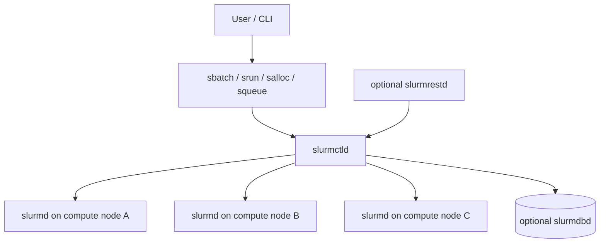

# Slurm: Cơ sở lý thuyết, kiến trúc và thực hành

## 1. Mục tiêu tài liệu

Tài liệu này trình bày Slurm theo hướng lý thuyết kết hợp thực hành, giúp người học nắm được:

- Slurm là gì và vì sao Slurm được dùng để quản lý cluster, lập lịch job và phân bổ tài nguyên tính toán.
- Kiến trúc Slurm gồm `slurmctld`, `slurmd`, optional `slurmdbd`, optional `slurmrestd` và các công cụ dòng lệnh cho người dùng.
- Các khái niệm cốt lõi như node, partition, job, allocation, job step, task, queue, priority và job state.
- Cách kiểm tra trạng thái cluster bằng `sinfo`, `squeue` và `scontrol`.
- Cách submit batch job bằng `sbatch`.
- Cách chạy job hoặc job step bằng `srun`.
- Cách xin tài nguyên tương tác bằng `salloc`.
- Cách hủy job bằng `scancel` và xem accounting bằng `sacct`.
- Cách dùng job array, dependency, output file pattern và GPU/GRES ở mức cơ bản.
- Các lỗi thường gặp khi dùng Slurm trong môi trường HPC.

Tài liệu này tổng hợp và diễn giải từ tài liệu chính thức của Slurm Workload Manager do SchedMD duy trì, chủ yếu dựa trên bộ tài liệu Slurm version 26.05 được liệt kê ở cuối tài liệu. Khi làm việc trên cluster thực tế, cần kiểm tra tài liệu hoặc man page đúng phiên bản Slurm của cluster đó, vì cấu hình site, plugin, partition, giới hạn tài nguyên và chính sách vận hành có thể khác nhau.

## 2. Tổng quan về Slurm

Theo tài liệu chính thức của SchedMD, Slurm là hệ thống quản lý cluster và lập lịch job mã nguồn mở, có khả năng fault-tolerant và scalable, dùng cho các Linux cluster nhỏ và lớn. Slurm không yêu cầu sửa Linux kernel để hoạt động và tương đối self-contained.

Với vai trò cluster workload manager, Slurm có ba chức năng chính:

- Cấp quyền truy cập exclusive hoặc non-exclusive vào tài nguyên, thường là compute nodes, trong một khoảng thời gian để người dùng thực hiện công việc.
- Cung cấp framework để bắt đầu, chạy và theo dõi công việc trên tập node đã được cấp phát.
- Điều phối tranh chấp tài nguyên bằng cách quản lý queue của các pending jobs.

Workflow phổ biến:

```text
User -> submit job -> Slurm queue -> scheduler allocates resources -> job runs -> output/accounting
```

Trong môi trường nghiên cứu hoặc HPC, người dùng thường không chạy tác vụ nặng trực tiếp trên login node. Thay vào đó, họ mô tả tài nguyên cần dùng và gửi job cho Slurm. Slurm quyết định khi nào job được chạy dựa trên tài nguyên hiện có, partition, priority, limit và chính sách của cluster.

## 3. Kiến trúc Slurm

Theo Slurm Overview và Quick Start User Guide, Slurm có kiến trúc tập trung quanh daemon quản lý và daemon chạy trên compute node.

| Thành phần | Vai trò |
| --- | --- |
| `slurmctld` | Central manager, theo dõi resources và work. Có thể có backup manager để failover. |
| `slurmd` | Daemon chạy trên mỗi compute node, chờ work, chạy work, trả status và tiếp tục chờ work mới. |
| `slurmdbd` | Optional Slurm Database Daemon, lưu accounting information cho một hoặc nhiều cluster Slurm. |
| `slurmrestd` | Optional Slurm REST API Daemon, cho phép tương tác với Slurm qua REST API. |
| User commands | Các lệnh như `sbatch`, `srun`, `squeue`, `sinfo`, `scancel`, `sacct`, `scontrol`. |

Sơ đồ tổng quát:



Các user commands có thể chạy ở bất kỳ đâu trong cluster theo Quick Start User Guide. Tuy nhiên, cách truy cập thực tế phụ thuộc vào chính sách của từng hệ thống.

## 4. Các thực thể Slurm quản lý

Slurm Overview mô tả các thực thể chính gồm nodes, partitions, jobs, allocations và job steps.

| Khái niệm | Ý nghĩa |
| --- | --- |
| Node | Compute resource trong Slurm. |
| Partition | Nhóm logical các node, có thể xem như job queue với constraint riêng. |
| Job | Công việc hoặc yêu cầu tài nguyên được gửi bởi user. |
| Allocation | Tài nguyên được cấp cho user/job trong một khoảng thời gian. |
| Job step | Tập các task chạy bên trong một allocation. |
| Task | Đơn vị thực thi do job step tạo ra, thường tương ứng với process/rank. |

Quan hệ cơ bản:

```text
Partition -> contains nodes
Job -> requests resources from partition
Allocation -> nodes/resources granted to job
Job step -> tasks running inside allocation
```

Theo Overview, partition có thể được xem như queue, mỗi partition có thể có giới hạn như job size limit, job time limit, nhóm user được phép dùng và các constraint khác.

## 5. Batch job, interactive job và job step

Slurm hỗ trợ nhiều cách chạy công việc.

| Cách chạy | Công cụ thường dùng | Khi dùng |
| --- | --- | --- |
| Batch job | `sbatch` | Gửi script để chạy sau khi scheduler cấp tài nguyên. |
| Real-time allocation | `salloc` | Xin tài nguyên tương tác, thường để debug hoặc chạy nhiều `srun`. |
| Job execution / job step | `srun` | Khởi chạy job hoặc job step, có thể dùng trong allocation đã có. |

Theo `sbatch` manual, `sbatch` gửi batch script đến Slurm rồi thoát sau khi script được chuyển thành công đến controller và được gán job ID. Job không nhất thiết được cấp tài nguyên ngay; nó có thể nằm pending trong queue cho đến khi tài nguyên phù hợp sẵn sàng.

Theo Quick Start User Guide, `salloc` thường được dùng để cấp tài nguyên trong real time và spawn shell; shell đó sau đó dùng `srun` để launch parallel tasks.

## 6. Các lệnh Slurm quan trọng

| Lệnh | Vai trò |
| --- | --- |
| `sinfo` | Báo cáo trạng thái partition và node do Slurm quản lý. |
| `squeue` | Xem trạng thái jobs hoặc job steps trong Slurm queue. |
| `sbatch` | Submit batch script để chạy sau. |
| `srun` | Submit job để chạy hoặc khởi tạo job step trong real time. |
| `salloc` | Allocate tài nguyên cho job trong real time. |
| `scancel` | Hủy pending/running job hoặc job step; cũng có thể gửi signal. |
| `sacct` | Báo cáo accounting information cho active hoặc completed jobs/job steps. |
| `scontrol` | Công cụ admin để xem hoặc sửa state/configuration của Slurm. |
| `sacctmgr` | Quản lý database, ví dụ cluster, user, account nếu dùng accounting database. |
| `sprio` | Hiển thị chi tiết thành phần ảnh hưởng đến priority của job. |
| `sstat` | Lấy thông tin tài nguyên sử dụng bởi running job hoặc job step. |
| `sview` | Giao diện đồ họa xem state của jobs, partitions và nodes. |

Các command option trong Slurm là case-sensitive theo Quick Start User Guide.

## 7. Kiểm tra trạng thái cluster bằng `sinfo`

`sinfo` báo cáo trạng thái partitions và nodes.

Ví dụ:

```bash
sinfo
```

Output thường có các cột như:

```text
PARTITION AVAIL  TIMELIMIT  NODES  STATE NODELIST
debug*       up      30:00      3   idle node[01-03]
batch        up   16:00:00      2  alloc node[04-05]
```

Ý nghĩa:

| Cột | Ý nghĩa |
| --- | --- |
| `PARTITION` | Tên partition. Dấu `*` thường chỉ default partition trong ví dụ Quick Start. |
| `AVAIL` | Partition có available hay không. |
| `TIMELIMIT` | Giới hạn thời gian của partition. |
| `NODES` | Số node trong dòng trạng thái đó. |
| `STATE` | Trạng thái node, ví dụ idle, alloc, down. |
| `NODELIST` | Danh sách node, có thể dùng range expression. |

Một số lệnh hữu ích:

```bash
sinfo -l
sinfo -N
sinfo -p debug
```

`sinfo` có nhiều tùy chọn filter, sort và format; trên cluster thực tế nên xem `sinfo --help` hoặc man page tương ứng.

## 8. Kiểm tra job queue bằng `squeue`

`squeue` dùng để xem thông tin job và job step của jobs do Slurm quản lý.

Ví dụ:

```bash
squeue
```

Theo `squeue` manual, default format có các trường như job id, partition, job name, user, state, time, number of nodes và reason/nodelist.

Ví dụ output:

```text
JOBID PARTITION     NAME     USER ST       TIME NODES NODELIST(REASON)
12345     debug     test    alice  R       1:20     1 node01
12346     batch    train      bob PD       0:00     2 (Resources)
```

Một số field quan trọng:

| Field | Ý nghĩa |
| --- | --- |
| `JOBID` | ID của job. |
| `PARTITION` | Partition job đang dùng hoặc đang chờ. |
| `NAME` | Tên job. |
| `USER` | User sở hữu job. |
| `ST` | State dạng ngắn. |
| `TIME` | Thời gian job đã chạy. |
| `NODES` | Số node được cấp hoặc yêu cầu tối thiểu. |
| `NODELIST(REASON)` | Node được cấp hoặc lý do job pending. |

Ví dụ xem job của user hiện tại:

```bash
squeue -u "$USER"
```

Ví dụ format output:

```bash
squeue -o "%.18i %.9P %.8j %.8u %.2t %.10M %.6D %R"
```

Theo Quick Start, pending reason phổ biến có thể là `Resources` hoặc `Priority`.

## 9. Job state cơ bản

Theo Job State Codes, mỗi job trong Slurm có một state. Khi `squeue` và `sacct` báo cáo state, chúng biểu diễn state theo cách phù hợp với command đó.

Một số state thường gặp:

| State | Ý nghĩa |
| --- | --- |
| `PENDING` | Job đang trong queue và chờ được bắt đầu. |
| `RUNNING` | Job đã được cấp tài nguyên và đang chạy. |
| `COMPLETED` | Job hoàn thành thành công với exit code 0 trên tất cả nodes. |
| `FAILED` | Job hoàn thành không thành công, ví dụ non-zero exit code hoặc failure condition khác. |
| `CANCELLED` | Job bị hủy bởi user hoặc administrator. |
| `TIMEOUT` | Job bị kết thúc do đạt time limit. |
| `OUT_OF_MEMORY` | Job gặp lỗi out of memory. |
| `NODE_FAIL` | Job kết thúc do node failure. |
| `SUSPENDED` | Job đã được cấp tài nguyên nhưng execution bị suspended. |

Một số flag/state phụ:

| Flag | Ý nghĩa |
| --- | --- |
| `COMPLETING` | Job đã kết thúc hoặc bị hủy và đang cleanup. |
| `CONFIGURING` | Job đã được cấp node và đang chờ node boot/reboot. |
| `REQUEUED` | Job đang được requeue. |

Trong output `squeue`, state có thể xuất hiện dạng rút gọn như `R` cho running và `PD` cho pending trong ví dụ Quick Start.

## 10. Submit batch job bằng `sbatch`

`sbatch` dùng để submit batch script cho Slurm.

Ví dụ file `hello.slurm`:

```bash
#!/bin/bash
#SBATCH --job-name=hello
#SBATCH --partition=debug
#SBATCH --nodes=1
#SBATCH --ntasks=1
#SBATCH --cpus-per-task=1
#SBATCH --mem=1G
#SBATCH --time=00:05:00
#SBATCH --output=slurm-%j.out

hostname
srun hostname
```

Submit:

```bash
sbatch hello.slurm
```

Theo `sbatch` manual:

- Batch script có thể chứa một hoặc nhiều dòng bắt đầu bằng `#SBATCH`, theo sau là các CLI options.
- `#SBATCH` directives được Slurm đọc trực tiếp; shell-specific syntax như biến shell sẽ được đọc như literal text.
- Sau dòng đầu tiên không phải comment và không phải whitespace, các `#SBATCH` directives phía sau sẽ không được xử lý nữa.
- Mặc định stdout và stderr được ghi vào file `slurm-%j.out`, trong đó `%j` được thay bằng job allocation number.
- Khi allocation được cấp, Slurm chạy một bản copy của batch script trên một node trong allocation.

## 11. Tùy chọn tài nguyên thường dùng

Các tùy chọn bên dưới xuất hiện trong `sbatch`, `srun` hoặc `salloc` tùy ngữ cảnh. Chi tiết chính xác cần xem man page của command tương ứng.

| Tùy chọn | Ý nghĩa |
| --- | --- |
| `--partition` hoặc `-p` | Chọn partition cho job. |
| `--job-name` hoặc `-J` | Đặt tên job. |
| `--nodes` hoặc `-N` | Chọn số node tối thiểu/tối đa. |
| `--ntasks` hoặc `-n` | Số task cần tạo cho job. |
| `--cpus-per-task` hoặc `-c` | Số CPU cấp cho mỗi task. |
| `--ntasks-per-node` | Giới hạn số task trên mỗi node. |
| `--mem` | Memory tối thiểu cần cho job. |
| `--mem-per-cpu` | Memory tối thiểu trên mỗi CPU được cấp. |
| `--time` hoặc `-t` | Time limit của job. |
| `--output` hoặc `-o` | File stdout. |
| `--error` hoặc `-e` | File stderr. |
| `--constraint` hoặc `-C` | Yêu cầu node có feature nhất định. |
| `--nodelist` hoặc `-w` | Yêu cầu danh sách node cụ thể. |
| `--exclude` hoặc `-x` | Loại trừ danh sách node cụ thể. |

CPU Management Guide mô tả Slurm quản lý CPU qua các bước: chọn node, cấp CPU từ các node đã chọn, phân phối task lên node, và tùy chọn phân phối/binding task vào CPU bên trong node.

## 12. Chạy job hoặc job step bằng `srun`

Theo Quick Start User Guide, `srun` dùng để submit job for execution hoặc initiate job steps in real time. `srun` có nhiều tùy chọn để mô tả yêu cầu tài nguyên như số node, số processor, node cụ thể hoặc đặc tính node.

Ví dụ chạy `hostname` trên ba node:

```bash
srun -N3 -l /bin/hostname
```

Ví dụ chạy bốn task:

```bash
srun -n4 -l /bin/hostname
```

Trong batch script, `srun` thường dùng để launch task bên trong allocation đã được `sbatch` cấp:

```bash
#!/bin/bash
#SBATCH --nodes=2
#SBATCH --ntasks=4
#SBATCH --time=00:10:00

srun -l /bin/hostname
```

Một job có thể chứa nhiều job steps chạy tuần tự hoặc song song, tùy allocation và tài nguyên còn trống bên trong allocation.

## 13. Xin tài nguyên tương tác bằng `salloc`

`salloc` dùng để allocate resources cho job trong real time. Quick Start mô tả cách dùng điển hình là allocate tài nguyên rồi spawn shell; shell đó dùng `srun` để launch parallel tasks.

Ví dụ:

```bash
salloc -N1 -n4 --time=00:30:00
```

Sau khi allocation được cấp:

```bash
srun -l /bin/hostname
```

Thoát khỏi shell allocation để trả tài nguyên.

`salloc` phù hợp khi:

- Debug script.
- Kiểm tra môi trường module/package.
- Chạy thử lệnh ngắn trước khi chuyển sang `sbatch`.
- Cần tương tác với job trong thời gian ngắn.

## 14. Hủy job bằng `scancel`

`scancel` dùng để hủy pending hoặc running job/job step. Theo Quick Start, nó cũng có thể gửi arbitrary signal đến các process liên quan đến running job hoặc job step.

Hủy một job:

```bash
scancel 12345
```

Hủy toàn bộ job của user hiện tại:

```bash
scancel -u "$USER"
```

Hủy job theo tên:

```bash
scancel --name=hello
```

Khi hủy job array, nếu truyền job ID của cả array thì toàn bộ phần tử array có thể bị hủy. Nếu chỉ muốn hủy một phần tử, dùng dạng `ArrayJobID_ArrayTaskID`, ví dụ:

```bash
scancel 20_4
```

## 15. Xem accounting bằng `sacct`

`sacct` báo cáo job hoặc job step accounting information cho active hoặc completed jobs.

Ví dụ:

```bash
sacct
```

Xem một job:

```bash
sacct -j 12345
```

Chọn field output:

```bash
sacct -j 12345 --format=JobID,JobName,State,ExitCode,Elapsed,AllocCPUS
```

`sacct` hữu ích khi job đã rời khỏi `squeue` nhưng cần xem trạng thái cuối, exit code, thời gian chạy hoặc thông tin accounting khác. Tùy cluster, accounting cần được cấu hình qua SlurmDBD hoặc accounting storage phù hợp.

## 16. Xem chi tiết bằng `scontrol`

`scontrol` là administrative tool để xem hoặc sửa state/configuration của Slurm. Quick Start lưu ý nhiều lệnh `scontrol` chỉ có thể chạy với quyền root.

Người dùng thường dùng `scontrol` để xem chi tiết:

```bash
scontrol show job 12345
scontrol show node node01
scontrol show partition
```

Ví dụ thông tin job có thể gồm:

- `JobId`
- `JobState`
- `Partition`
- `NumCPUs`
- `ReqNodes`
- `TimeLimit`
- `SubmitTime`
- `StartTime`
- `Command`
- `WorkDir`

`scontrol` cũng có thể update một số thuộc tính job, nhưng quyền thay đổi phụ thuộc vào chính sách cluster và quyền user.

## 17. Output file và environment variables

### 17.1. Output file

Theo `sbatch` manual, mặc định stdout và stderr của batch job được chuyển đến:

```text
slurm-%j.out
```

Trong đó `%j` được thay bằng job allocation number.

Ví dụ đặt output riêng:

```bash
#SBATCH --output=logs/%x-%j.out
#SBATCH --error=logs/%x-%j.err
```

Với job array, mặc định output file là:

```text
slurm-%A_%a.out
```

Trong đó `%A` là array job ID và `%a` là array task ID.

### 17.2. Environment variables

`sbatch` manual liệt kê các environment variables được Slurm controller đặt trong môi trường batch script.

Một số biến thường gặp:

| Biến | Ý nghĩa |
| --- | --- |
| `SLURM_JOB_ID` | ID của job allocation. |
| `SLURM_JOBID` | ID của job allocation, giữ cho backward compatibility. |
| `SLURM_JOB_DEPENDENCY` | Giá trị của `--dependency`. |
| `SLURM_JOB_GPUS` | Global GPU IDs được cấp cho job, nếu có. |
| `SLURM_ARRAY_JOB_ID` | Job ID đầu tiên của job array. |
| `SLURM_ARRAY_TASK_ID` | Index của task trong job array. |
| `SLURM_ARRAY_TASK_COUNT` | Số task trong job array. |
| `SLURM_ARRAY_TASK_MAX` | Index lớn nhất của job array. |
| `SLURM_ARRAY_TASK_MIN` | Index nhỏ nhất của job array. |

Ví dụ dùng trong script:

```bash
echo "Job ID: ${SLURM_JOB_ID}"
echo "Running on: $(hostname)"
```

## 18. Job dependency

`sbatch --dependency` cho phép trì hoãn job cho đến khi dependency được thỏa mãn.

Ví dụ:

```bash
sbatch first.slurm
sbatch --dependency=afterok:12345 second.slurm
```

Một số dependency type theo `sbatch` manual:

| Type | Ý nghĩa |
| --- | --- |
| `after` | Job có thể bắt đầu sau khi job chỉ định bắt đầu hoặc bị hủy, có thể cộng delay theo phút. |
| `afterany` | Job có thể bắt đầu sau khi job chỉ định kết thúc. Đây là default dependency type. |
| `afterok` | Job có thể bắt đầu sau khi job chỉ định hoàn thành thành công với exit code 0. |
| `afternotok` | Job có thể bắt đầu sau khi job chỉ định kết thúc ở trạng thái failed. |
| `aftercorr` | Với job array, task có thể bắt đầu sau khi task tương ứng trong job chỉ định hoàn thành thành công. |
| `singleton` | Job có thể bắt đầu sau khi các job trước đó có cùng job name và user đã kết thúc. |

Có thể dùng dấu phẩy để yêu cầu tất cả dependencies thỏa mãn hoặc dấu hỏi để chỉ cần một điều kiện thỏa mãn, theo cú pháp được `sbatch` manual mô tả.

## 19. Job array

Job array dùng để submit và quản lý nhiều job tương tự nhau một cách nhanh và dễ. Theo tài liệu Job Array Support, job arrays hữu ích cho workload lặp lại có chung pattern.

Submit array:

```bash
sbatch --array=0-31 job.slurm
```

Submit các index cụ thể:

```bash
sbatch --array=1,3,5,7 job.slurm
```

Submit range có step:

```bash
sbatch --array=1-7:2 job.slurm
```

Giới hạn số task chạy đồng thời bằng `%`:

```bash
sbatch --array=0-15%4 job.slurm
```

Trong script:

```bash
#!/bin/bash
#SBATCH --array=0-3
#SBATCH --output=slurm-%A_%a.out

echo "Array job: ${SLURM_ARRAY_JOB_ID}"
echo "Array task: ${SLURM_ARRAY_TASK_ID}"
```

Lưu ý theo Job Array Support:

- Job array chỉ được hỗ trợ cho batch jobs.
- Array index nhỏ nhất có thể chỉ định là 0.
- Maximum index phụ thuộc cấu hình `MaxArraySize` của Slurm.
- Các job trong cùng array phải có cùng initial options, ví dụ size và time limit.
- Mỗi array task vẫn hoạt động như regular job và chịu các job-related limits.

## 20. GPU và GRES

Slurm hỗ trợ Generic RESources, viết tắt là GRES. Theo tài liệu GRES Scheduling, Slurm có thể định nghĩa và schedule arbitrary generic resources. Một số GRES type có tính năng built-in riêng, gồm GPU, CUDA Multi-Process Service devices và sharding.

Theo tài liệu GRES:

- Mặc định cluster chưa bật GRES nào.
- Admin phải cấu hình GRES trong `slurm.conf`, ví dụ qua `GresTypes` và `Gres`.
- Jobs sẽ không được cấp generic resources nếu không request rõ tại lúc submit.

Các tùy chọn request GPU/GRES:

| Tùy chọn | Ý nghĩa |
| --- | --- |
| `--gres` | Generic resources required per node. |
| `--gpus` | GPUs required per job. |
| `--gpus-per-node` | GPUs required per node; tương đương `--gres` cho GPUs. |
| `--gpus-per-socket` | GPUs required per socket; yêu cầu job chỉ định task socket. |
| `--gpus-per-task` | GPUs required per task; yêu cầu job chỉ định task count. |

Ví dụ request GPU:

```bash
sbatch --gpus=1 gpu_job.slurm
```

Ví dụ dùng GRES:

```bash
sbatch --gres=gpu:1 gpu_job.slurm
```

Tên GPU type, số lượng GPU, cách bind CPU/GPU và visibility trong job phụ thuộc cấu hình cụ thể của cluster.

## 21. Ví dụ batch scripts

### 21.1. Job đơn giản

```bash
#!/bin/bash
#SBATCH --job-name=hostname
#SBATCH --nodes=1
#SBATCH --ntasks=1
#SBATCH --time=00:02:00
#SBATCH --output=slurm-%j.out

hostname
```

### 21.2. Multi-task job

```bash
#!/bin/bash
#SBATCH --job-name=multi-task
#SBATCH --nodes=2
#SBATCH --ntasks=4
#SBATCH --time=00:05:00
#SBATCH --output=slurm-%j.out

srun -l /bin/hostname
```

### 21.3. Job array

```bash
#!/bin/bash
#SBATCH --job-name=array-demo
#SBATCH --array=0-7%2
#SBATCH --time=00:02:00
#SBATCH --output=slurm-%A_%a.out

echo "array id=${SLURM_ARRAY_JOB_ID}"
echo "task id=${SLURM_ARRAY_TASK_ID}"
hostname
```

### 21.4. Dependency chain

```bash
job1=$(sbatch --parsable first.slurm)
sbatch --dependency=afterok:${job1} second.slurm
```

Ví dụ này dùng job ID của job đầu tiên để job thứ hai chỉ chạy sau khi job đầu tiên hoàn thành thành công.

## 22. Quy trình làm việc đề xuất

Một workflow an toàn khi dùng Slurm:

```text
Inspect cluster -> write small script -> test interactively -> submit batch -> monitor -> inspect output/accounting
```

Các bước:

1. Kiểm tra partition và node:

```bash
sinfo
```

2. Viết script nhỏ, request ít tài nguyên và time limit ngắn.

3. Submit:

```bash
sbatch job.slurm
```

4. Theo dõi:

```bash
squeue -u "$USER"
```

5. Xem output:

```bash
ls slurm-*.out
```

6. Xem accounting sau khi job kết thúc:

```bash
sacct -j <jobid> --format=JobID,JobName,State,ExitCode,Elapsed,AllocCPUS
```

7. Nếu lỗi, kiểm tra output file, `sacct`, `scontrol show job <jobid>` và giảm phạm vi thử nghiệm trước khi submit job lớn.

## 23. Các lỗi thường gặp

### 23.1. Job pending lâu

Dấu hiệu:

```text
ST = PD
NODELIST(REASON) = (Resources) hoặc (Priority)
```

Ý nghĩa thường gặp theo Quick Start:

- `Resources`: job đang chờ tài nguyên phù hợp.
- `Priority`: job đang xếp sau job có priority cao hơn.

Kiểm tra:

```bash
squeue -j <jobid>
scontrol show job <jobid>
sinfo
```

### 23.2. Request tài nguyên quá lớn

Nếu request quá nhiều node, CPU, memory, GPU hoặc time limit quá dài so với partition, job có thể pending lâu hoặc bị reject tùy policy.

Kiểm tra partition:

```bash
sinfo
scontrol show partition
```

Giảm request để test:

```bash
#SBATCH --nodes=1
#SBATCH --ntasks=1
#SBATCH --time=00:05:00
```

### 23.3. Đặt `#SBATCH` sai vị trí

Theo `sbatch` manual, sau dòng đầu tiên không phải comment và không phải whitespace, các `#SBATCH` directive phía sau sẽ không được xử lý.

Sai:

```bash
#!/bin/bash
echo "start"
#SBATCH --time=00:05:00
```

Đúng:

```bash
#!/bin/bash
#SBATCH --time=00:05:00
echo "start"
```

### 23.4. Dùng biến shell trong `#SBATCH`

Theo `sbatch` manual, `#SBATCH` directives được Slurm đọc trực tiếp, nên shell-specific syntax như variable names được đọc như literal text.

Ví dụ cần cẩn thận:

```bash
#SBATCH --output=logs/$USER-%j.out
```

Nếu muốn tạo logic động, thường submit với command-line option bên ngoài script hoặc sinh script theo cách phù hợp với môi trường.

### 23.5. Không thấy output

Mặc định output là:

```text
slurm-%j.out
```

Kiểm tra:

```bash
ls -lh slurm-*.out
sacct -j <jobid> --format=JobID,State,ExitCode
```

Nếu đã đặt `--output`, kiểm tra đúng thư mục và quyền ghi.

### 23.6. Job bị `TIMEOUT`

Theo Job State Codes, `TIMEOUT` nghĩa là job bị kết thúc do đạt time limit.

Cách xử lý:

- Tăng `--time` nếu partition cho phép.
- Chạy thử input nhỏ hơn.
- Chia job thành job array hoặc nhiều job nhỏ nếu workload phù hợp.
- Kiểm tra output để biết job dừng ở bước nào.

### 23.7. Job bị `OUT_OF_MEMORY`

Theo Job State Codes, `OUT_OF_MEMORY` nghĩa là job gặp lỗi out of memory.

Cách xử lý:

- Request memory rõ hơn bằng `--mem` hoặc `--mem-per-cpu`.
- Giảm số task/process nếu mỗi task dùng nhiều memory.
- Kiểm tra memory thực tế qua accounting nếu cluster thu thập dữ liệu đó.

### 23.8. GPU không được cấp

Theo tài liệu GRES, jobs không được cấp generic resources nếu không request rõ lúc submit.

Kiểm tra:

```bash
scontrol show job <jobid>
```

Request GPU theo policy cluster:

```bash
sbatch --gpus=1 gpu_job.slurm
```

hoặc:

```bash
sbatch --gres=gpu:1 gpu_job.slurm
```

Tên GRES và cú pháp chính xác có thể phụ thuộc cấu hình site.

## 24. Bài tập thực hành

### Bài 1: Kiểm tra cluster

Chạy:

```bash
sinfo
squeue
```

Ghi lại:

- Có những partition nào.
- Partition default là gì.
- Có node nào idle, alloc hoặc down không.
- Có job pending không và reason là gì.

### Bài 2: Submit job đơn giản

Tạo `hello.slurm`:

```bash
#!/bin/bash
#SBATCH --job-name=hello
#SBATCH --nodes=1
#SBATCH --ntasks=1
#SBATCH --time=00:02:00
#SBATCH --output=slurm-%j.out

hostname
```

Submit:

```bash
sbatch hello.slurm
```

Theo dõi bằng:

```bash
squeue -u "$USER"
```

### Bài 3: Dùng `srun`

Chạy:

```bash
srun -n4 -l /bin/hostname
```

Quan sát cách task được đánh số trong output.

### Bài 4: Dùng `salloc`

Xin allocation:

```bash
salloc -N1 -n2 --time=00:10:00
```

Trong allocation:

```bash
srun -l /bin/hostname
```

Thoát allocation sau khi xong.

### Bài 5: Job array

Tạo script:

```bash
#!/bin/bash
#SBATCH --array=0-3
#SBATCH --output=slurm-%A_%a.out

echo "task=${SLURM_ARRAY_TASK_ID}"
hostname
```

Submit:

```bash
sbatch array.slurm
```

Kiểm tra output file.

### Bài 6: Dependency

Submit hai job, job thứ hai chỉ chạy sau khi job đầu hoàn thành thành công:

```bash
job1=$(sbatch --parsable first.slurm)
sbatch --dependency=afterok:${job1} second.slurm
```

Theo dõi bằng:

```bash
squeue -u "$USER"
```

### Bài 7: Accounting

Sau khi job kết thúc:

```bash
sacct -j <jobid> --format=JobID,JobName,State,ExitCode,Elapsed,AllocCPUS
```

Ghi lại state và exit code.

## 25. Lộ trình học đề xuất

1. Hiểu Slurm là cluster workload manager và ba chức năng chính của Slurm.
2. Học kiến trúc `slurmctld`, `slurmd`, optional `slurmdbd` và các user commands.
3. Học node, partition, job, allocation, job step và task.
4. Dùng `sinfo` để hiểu partition/node của cluster.
5. Dùng `squeue` để đọc queue, state và pending reason.
6. Viết batch script tối thiểu bằng `sbatch`.
7. Dùng `srun` để chạy task bên trong allocation.
8. Dùng `salloc` để debug tương tác.
9. Dùng `scancel`, `sacct` và `scontrol show job` để vận hành và debug job.
10. Học job array cho workload lặp lại.
11. Học dependency để tạo pipeline nhiều bước.
12. Học GRES/GPU nếu cluster có tài nguyên GPU.
13. Đọc policy riêng của cluster đang dùng: partition, time limit, account, QoS, GPU, storage và login node rules.

## 26. Kết luận

Slurm là hệ thống quản lý workload quan trọng trong môi trường Linux cluster và HPC. Về mặt kiến trúc, Slurm dùng `slurmctld` làm central manager, `slurmd` trên compute nodes để chạy work, và có thể dùng `slurmdbd` cho accounting hoặc `slurmrestd` cho REST API.

Với người dùng, các thao tác quan trọng nhất là kiểm tra cluster bằng `sinfo`, xem queue bằng `squeue`, gửi job bằng `sbatch`, chạy task bằng `srun`, xin allocation tương tác bằng `salloc`, hủy job bằng `scancel`, xem accounting bằng `sacct` và xem chi tiết bằng `scontrol`. Khi dùng Slurm hiệu quả, cần request tài nguyên sát nhu cầu, đặt time limit hợp lý, hiểu partition, đọc pending reason, kiểm tra output/accounting và thử nghiệm nhỏ trước khi chạy job lớn.

## 27. Tài liệu tham khảo

- Slurm Workload Manager Overview: https://slurm.schedmd.com/overview.html
- Slurm Quick Start User Guide: https://slurm.schedmd.com/quickstart.html
- Slurm `sbatch`: https://slurm.schedmd.com/sbatch.html
- Slurm `srun`: https://slurm.schedmd.com/srun.html
- Slurm `salloc`: https://slurm.schedmd.com/salloc.html
- Slurm `sinfo`: https://slurm.schedmd.com/sinfo.html
- Slurm `squeue`: https://slurm.schedmd.com/squeue.html
- Slurm `scancel`: https://slurm.schedmd.com/scancel.html
- Slurm `sacct`: https://slurm.schedmd.com/sacct.html
- Slurm `scontrol`: https://slurm.schedmd.com/scontrol.html
- Slurm Job State Codes: https://slurm.schedmd.com/job_state_codes.html
- Slurm Job Array Support: https://slurm.schedmd.com/job_array.html
- Slurm Generic Resource (GRES) Scheduling: https://slurm.schedmd.com/gres.html
- Slurm CPU Management User and Administrator Guide: https://slurm.schedmd.com/cpu_management.html
- Slurm `slurm.conf`: https://slurm.schedmd.com/slurm.conf.html
